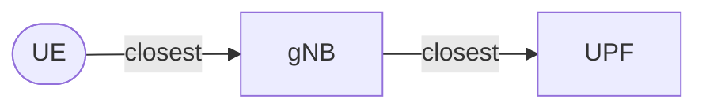

# Julia-based Discrete Event Simulator for evaluating scalability of 5G Networks and beyond

This is the documentation for the Julia-based Discrete Event Simulator designed to evaluate the scalability of 5G networks and beyond.

The simulator allows researchers and network engineers to model, simulate, and analyze various network scenarios, focusing on the deployment and performance of User Plane Functions (UPFs) across different geographic regions.

## How it Works in a Nutshell

The simulator constructs a network graph using three main elements: **UEs** (Agents), **gNBs** (Base Stations), and **UPFs**.

1.  **Distribute UEs**. We distribute User Equipment based on real population density using data from sources like **INE** (Spain) or **Census Bureau** (USA).
2.  **Place gNBs**. We use [OpenCellID](https://opencellid.org/) data to place Base Stations for specific operators.
3.  **Optimize UPF Placement**. We use the **K-means algorithm** to find optimal UPF locations based on user density.
4.  **Connect the Graph**: Elements are connected based on proximity:

!!! tip "Data Sources"
    You just need to worry about providing enough data for the agents using a trustable source.
    More information about how to prepare the data can be found in the [Agents documentation](agents/getting-data-ready.md).

It supports multiple countries and operators, enabling comprehensive testing of network configurations and strategies. So far it has support for Spain and the USA, but more countries can be easily added by following the [Agents documentation](agents/getting-data-ready.md).

## Visualizations

Explore the generated network topologies and agent distributions for our supported scenarios.

=== "Spain (Movistar) :flag_es:"

    **Topology Map**
    
    

    **Network Graph**
    
    

=== "USA (Verizon) :flag_us:"

    **Topology Map**
    
    

    **Network Graph**

    
    

