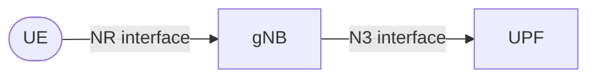

# Julia-based Discrete Event Simulator for evaluating scalability of 5G Networks and beyond

This is the documentation for the Julia-based Discrete Event Simulator designed to evaluate the scalability of 5G networks and beyond.

??? question "Julia? Why?"
    I could see myself asking this question if past me would be looking at this. While in Boston, I attended a workshop in the MIT about Dyad, a framework for  modeling and simulation, but more suited for systems that require essentially continuous time simulations.

    It was interesting but not really suitable for this use case. However, Julia kind of caught my attention, as it is designed for high-performance numerical and scientific computing, combining the ease of use of languages like Python with the speed of C/C++. After some research, I found out that Julia has a strong ecosystem for discrete event simulation, including packages like `ConcurrentSim`, which provides a robust framework for building and running simulations. I implemented a quick proof of concept and I was amazed on how efficient Julia is. So this made Julia a very attractive choice for developing a discrete event simulator tailored to evaluating the scalability of 5G networks and beyond.

    And this is the result :D

The simulator allows researchers and network engineers to model, simulate, and analyze various network scenarios, focusing on the deployment and performance of User Plane Functions (UPFs) across different geographic regions.

The simulator is built around three main elements:

* **Agents**: Representing users or devices distributed across municipalities within a country.
* **Base Stations**: Using OpenCellID data to simulate real-world cellular network coverage.
* **UPFs**: UPFs get automatically distributed based on K-Means clustering, depending on **gNB density**. In other words, UPFs are placed in optimal locations to minimize latency and maximize performance for the distributed base stations.

Then, these elements are connected based on proximity.

It supports multiple **countries** and **operators**, enabling comprehensive testing of network configurations and strategies. So far it has support for Spain and the USA, but more countries can be easily added by following the [Agents documentation](agents/getting-data-ready.md).

<!-- ??? tip "Population Data Sources"

    You just need to worry about providing enough data for the agents using a trustable source. For example:
    
    * In **Spain** :flag_es:, you can use the INE (Instituto Nacional de Estadística).
    * In the **USA** :flag_us:, you can use the Census Bureau.
    
    More information about how to prepare the data can be found in the [Agents documentation](agents/getting-data-ready.md). -->

[Know a bit more...](./simulation-details/in-a-nutshell/in-a-nutshell.md){ .md-button .md-button--primary }

## Visualizations

Explore the generated network topologies and agent distributions for our supported scenarios.

=== "Spain (Movistar) :flag_es:"

    **Topology Map**
    
    

    **Network Graph**
    
    
=== "USA (Verizon) :flag_us:"

    **Topology Map**
    
    

    **Network Graph**
    
    
