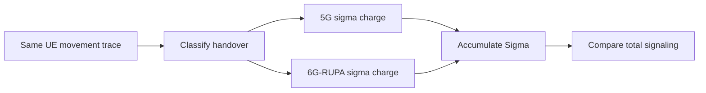
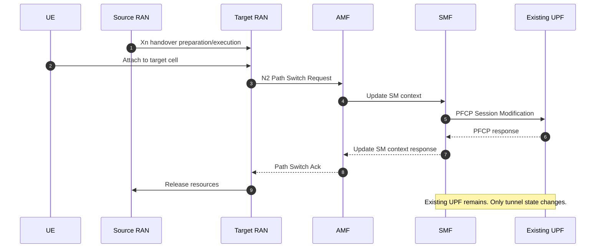
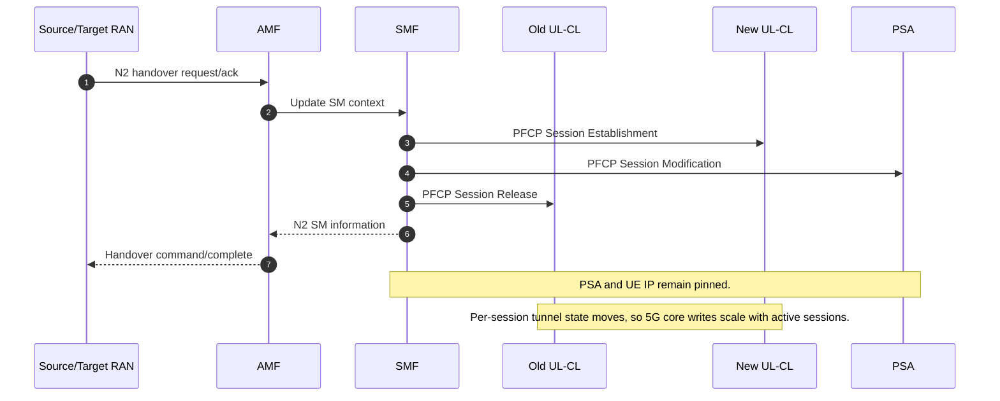

# Mobility Sigma Accounting

PLMN-GraphSim treats mobility signaling as a per-handover byte counter, denoted
$\sigma$. The simulator does not replay packet-level protocol messages. Instead,
each detected cell change is classified, charged with the procedure cost below,
and accumulated over the run.

The same handover stream feeds both architectures. The only difference is the
per-event charge.



## Constants

| Event | 5G charge | 6G-RUPA charge | Simulator counters |
|---|---:|---:|---|
| L1: same edge UPF | 600 B | 200 B | `sigma_5g_xn`, `sigma_rupa_intra` |
| L2: edge UPF / UL-CL changes, PSA pinned | 1150 B | 200 B | `sigma_5g_n2`, `sigma_rupa_inter` |
| Optional PSA relocation, SSC mode 2/3 | ~1500 B | 200 B | not charged in routine SSC-1 runs |
| Roaming entry, deployed HR re-establishment | 3250 B | 450 B | `sigma_roam_5g`, `sigma_roam_rupa` |
| Roaming entry, idealized 5G border handover | 1300 B | 450 B | sensitivity mode |

Routine intra-PLMN mobility uses SSC mode 1: the PSA is pinned for the PDU
session lifetime. Crossing into another PSA region is therefore still an L2 event
in the simulator; the cost is path stretch, not PSA relocation.

## 5G L1: Xn Path Switch

L1 is a gNB-to-gNB handover where the same edge UPF remains selected. 5G updates
the N3 tunnel endpoint with one PFCP Session Modification. PLMN-GraphSim charges
600 B.



## 5G L2: UL-CL Relocation, PSA Preserved

L2 is a gNB-to-gNB handover where the serving edge UPF or UL-CL changes, but the
PSA and UE IP address remain pinned. PLMN-GraphSim charges 1150 B: N2 handover
signaling plus PFCP release, establishment, and modification operations.



## 6G-RUPA: Flat Renumbering

6G-RUPA charges the same 200 B renumber at every intra-PLMN level. The moving UE
obtains a new location-dependent address synonym under an aggregate that already
exists. Active flows survive because EFCP connections are keyed by connection and
port identifiers, not by the address synonym.

```mermaid
sequenceDiagram
    autonumber
    participant UE as UE IPCP
    participant DAF as DIF management
    participant RIB as Local RIB
    participant RT as Neighbours
    participant PEER as Peer IPCP
    participant CORE as Core aggregate

    UE->>DAF: Move detected in DIF
    DAF->>RIB: Assign new address synonym
    UE->>RT: Advertise new synonym locally
    RT-->>RT: Local reconvergence
    UE->>PEER: Flow-update for active flow
    PEER-->>PEER: Keep EFCP connection/port IDs
    DAF->>RIB: Retire old synonym after timeout
    CORE-->>CORE: Aggregate prefix set unchanged

    Note over UE,PEER: Flow identity survives address change.
    Note over CORE: Delta S_core = 0; sigma approx. 200 B.
```

## Roaming Entry

For deployed 5G Home-Routed roaming, PLMN-GraphSim models a border crossing as
PLMN reselection plus a new HR PDU-session establishment. The charged event is
3250 B and the 5G flow breaks. The idealized 1300 B mode is kept only as a
sensitivity case.

For 6G-RUPA, first entry into the internetwork layer costs 450 B: enrollment,
renumbering, and one internetwork advertisement. Later moves return to the flat
200 B renumber.

```mermaid
sequenceDiagram
    autonumber
    participant UE as UE
    participant VPLMN as Visited PLMN
    participant SEPP as SEPP/N32
    participant HPLMN as Home PLMN

    UE->>VPLMN: Border entry / visited attachment
    VPLMN->>SEPP: HR PDU-session establishment leg
    SEPP->>HPLMN: Nsmf create + policy/charging context
    HPLMN->>VPLMN: Home anchor and N9 path setup
    VPLMN-->>UE: New HR session accepted

    Note over VPLMN,HPLMN: 5G HR entry approx. 3250 B; session re-established.
```

```mermaid
sequenceDiagram
    autonumber
    participant UE as UE IPCP
    participant V as Visited DIF
    participant I as Internetwork DIF
    participant H as Home/operator DIF

    UE->>V: Enroll in visited DIF
    UE->>V: Renumber under visited aggregate
    V->>I: Advertise/reach internetwork aggregate
    I-->>H: Forward by aggregate, no fixed home anchor

    Note over UE,I: First entry approx. 450 B; subsequent moves approx. 200 B.
```

## Output Interpretation

The reported signaling totals are cumulative byte counters:

$$
\Sigma_{5G} = \sigma_{5G}^{Xn} + \sigma_{5G}^{N2} + \sigma_{5G}^{roam},
\qquad
\Sigma_{RUPA} = \sigma_{RUPA}^{intra} + \sigma_{RUPA}^{inter} + \sigma_{RUPA}^{roam}.
$$

The advantage is computed from totals, not from a hard-coded percentage:

$$
A = 1 - \frac{\Sigma_{RUPA}}{\Sigma_{5G}}.
$$

Because national intra-PLMN traces are dominated by L1 handovers, the aggregate
advantage stays near the L1 ratio $1 - 200/600 = 66.7\%$, with a small increase
as the L2 share grows.
