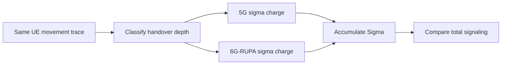

# Mobility Sigma Accounting

PLMN-GraphSim treats mobility signaling as a per-handover byte counter, denoted
$\sigma$. The simulator does not replay packet-level protocol messages. Instead,
each detected cell change is classified by depth, charged with the constant for that
depth, and accumulated over the run.

The same handover stream feeds both architectures. The only difference is the
per-event charge.



This page covers how to read the mobility scenario's output. The constants themselves
are derived in [The Signaling Cost Model](../../simulation-details/signaling-cost-model.md),
and the procedure behind each one is drawn out message by message in
[Handover Sequence Diagrams](../../simulation-details/handover-sequence-diagrams.md).

## Constants

| Event | 5G charge | 6G-RUPA charge | Simulator counters |
|---|---:|---:|---|
| $d=1$: serving edge UPF unchanged | 600 B | 200 B | `sigma_5g_xn`, `sigma_rupa_intra` |
| $d=2$: serving edge UPF or UL-CL changes, PSA pinned | 1150 B | 200 B | `sigma_5g_n2`, `sigma_rupa_inter` |
| $d=3$: PSA relocation, SSC mode 2 or 3 | 2200 to 2700 B | 200 B | not charged in routine SSC-1 runs |
| $d=4$: roaming entry, deployed HR re-establishment | 3250 B | 450 B | `sigma_roam_5g`, `sigma_roam_rupa` |
| $d=4$: roaming entry, idealized 5G border handover | 1300 B | 450 B | sensitivity mode |

Routine intra-PLMN mobility uses SSC mode 1: the PSA is pinned for the PDU session
lifetime. Crossing into another PSA region is therefore still a $d=2$ event in the
simulator; the cost surfaces as path stretch, not as PSA relocation. $d=3$ is a policy
decision rather than a geometric one, so it never fires on a routine run.

!!! warning "The counter names are historical, and they misname the classification"

    `sigma_5g_xn` and `sigma_5g_n2` suggest that $d=1$ means an Xn handover and $d=2$
    means an N2 handover. That is not what the simulator computes, and it is not how
    3GPP works. **Which RAN procedure runs (Xn or N2) and whether the serving UPF
    changes are independent axes.** TS 23.502 Sec. 4.9.1.2.4 is an Xn handover that
    *does* relocate the intermediate UPF, and Sec. 4.9.1.3 step 5 is conditional, so an
    N2 handover may well keep it.

    `src/Simulation/Handover.jl` classifies on the UPF, never on the RAN procedure:

    ```julia
    handover_level(topology, old_upf, new_upf) = old_upf == new_upf ? 1 : 2
    ```

    Read `sigma_5g_xn` as "depth-one bytes" and `sigma_5g_n2` as "depth-two bytes". The
    numbers are unaffected; only the names are wrong. See
    [Handover Sequence Diagrams](../../simulation-details/handover-sequence-diagrams.md)
    Sec. 2 for the full taxonomy.

## What Each Depth Charges

**$d=1$, serving edge UPF unchanged, 600 B.** The user moves between base stations
served by the same edge UPF. Only the N3 tunnel endpoint is rewritten, through one PFCP
Session Modification. Realized by TS 23.502 Sec. 4.9.1.2.2 over Xn, or by Sec. 4.9.1.3
with the conditional UPF selection skipped.

**$d=2$, serving edge UPF or UL-CL changes, PSA preserved, 1150 B.** The user crosses
into another edge UPF's region. The old session is released, a new one established, and
the path repointed at both ends, while the PSA and the UE's IP address stay pinned.
Realized by TS 23.502 Sec. 4.9.1.2.4 over Xn, which is the common case since
neighbouring gNBs usually do have Xn, or by Sec. 4.9.1.3 where there is no Xn.

**6G-RUPA, 200 B at every depth.** The moving node obtains a new location-dependent
address synonym under an aggregate that already exists. Active flows survive because
EFCP connections are keyed by connection-endpoint and port identifiers rather than by
the address. Core forwarding state is untouched, so $\Delta S_{\mathrm{core}} = 0$
whatever the depth.

!!! note "The 200 B is flat in depth, not in flow count"

    $\sigma_{\mathrm{RUPA}} = 50 + 150F$ for a node carrying $F$ active flows: 50 B of
    address and local-routing metadata plus a 150 B rebinding exchange per flow. The
    200 B headline is the $F=1$ case of the modelled eMBB profile. 5G rewrites one
    tunnel per session however many flows it carries, so a node holding many concurrent
    flows narrows and eventually inverts the signaling comparison, at $F \ge 4$ against
    $d=1$ and $F \ge 8$ against $d=2$. Depth flatness is unaffected either way.

## Roaming Entry

For deployed 5G Home-Routed roaming, the simulator models a border crossing as PLMN
reselection plus a new HR PDU-session establishment: 3250 B, and the 5G flow breaks.
The idealized connected-mode inter-PLMN handover, 1300 B with the session surviving, is
kept as a sensitivity mode because 3GPP does specify it even though it is not the
deployed default.

For 6G-RUPA, first entry into the internetwork layer costs 450 B, covering enrollment,
renumbering, and one internetwork advertisement. Later moves return to the flat 200 B
renumber, since enrollment is charged once rather than per event.

Both border semantics are reported, at 86.2 % and 65.4 % advantage respectively.

## Output Interpretation

The reported signaling totals are cumulative byte counters, summed over depth:

$$
\Sigma_{5\mathrm{G}} = \sigma_{5\mathrm{G}}^{d=1} + \sigma_{5\mathrm{G}}^{d=2} + \sigma_{5\mathrm{G}}^{\mathrm{roam}},
\qquad
\Sigma_{\mathrm{RUPA}} = \sigma_{\mathrm{RUPA}}^{d=1} + \sigma_{\mathrm{RUPA}}^{d=2} + \sigma_{\mathrm{RUPA}}^{\mathrm{roam}}.
$$

In the output columns those three 5G terms are `Sigma_5G_Xn`, `Sigma_5G_N2` and
`Sigma_Roam_5G`, with the naming caveat above.

The advantage is computed from totals, not from a hard-coded percentage:

$$
A = 1 - \frac{\Sigma_{\mathrm{RUPA}}}{\Sigma_{5\mathrm{G}}}.
$$

Because national intra-PLMN traces are dominated by depth-one handovers, the aggregate
advantage stays near the depth-one ratio $1 - 200/600 = 66.7\,\%$, rising slowly as the
depth-two share $\beta$ grows. $\beta$ is a property of how the deployment cuts its
regions, not of how fast the user travels, so a coarse UPF partition and a fine one
produce different aggregates from identical mobility.

## Results

The sweep in `results/national-sweep.csv` covers 27 operator fields across six
countries, each run under pedestrian (5 km/h), urban (50 km/h) and highway (120 km/h)
mobility, for 81 runs. Reproduce with `julia --project=. runs/national_sweep.jl`.

### By Country

| Country | Runs | Operators | gNBs (max) | Advantage $A$ | $\beta$ (depth-two share) | Path-length excess |
|---|---:|---:|---:|---:|---:|---:|
| Canada | 18 | 3 | 20 077 | 67.15 to 68.03 % | 1.59 to 4.67 % | 0.00 to 0.54 km |
| France | 24 | 4 | 116 993 | 66.91 to 67.56 % | 0.79 to 3.00 % | 0.12 to 2.80 km |
| Mexico | 9 | 3 | 163 116 | 67.72 to 71.52 % | 3.56 to 18.61 % | 0.02 to 0.25 km |
| Portugal | 9 | 3 | 7 350 | 67.07 to 67.85 % | 1.32 to 4.02 % | 0.04 to 0.46 km |
| Spain | 9 | 3 | 46 396 | 66.85 to 67.30 % | 0.60 to 2.12 % | 0.10 to 5.09 km |
| USA | 12 | 4 | 277 160 | 67.68 to 68.67 % | 3.42 to 6.98 % | 0.37 to 2.14 km |

Across all 81 runs the advantage stays in a 4.7-point band, 66.85 to 71.52 %, with a
mean of 67.76 %. The floor is the depth-one ratio of 66.7 %, which no deployment can go
below, and the spread above it is entirely $\beta$.

Mexico is the instructive outlier. Its $\beta$ reaches 18.61 % where Spain's stays under
2.12 %, and its advantage rises with it to 71.52 %. That is a coarser UPF partition, not
faster users: the same three mobility profiles run everywhere.

### By Speed

| Profile | Runs | Handovers per user-hour | $\beta$ | Advantage $A$ | Path-length excess |
|---|---:|---:|---:|---:|---:|
| Pedestrian, 5 km/h | 27 | 1.77 to 7.81 | 0.60 to 16.14 % | 66.85 to 70.96 % | 0.00 to 1.74 km |
| Urban, 50 km/h | 27 | 16.88 to 59.30 | 0.93 to 17.09 % | 66.95 to 71.18 % | 0.00 to 2.80 km |
| Highway, 120 km/h | 27 | 33.83 to 112.95 | 1.40 to 18.61 % | 67.09 to 71.52 % | 0.01 to 5.09 km |

Speed moves the event *rate* by a factor of roughly 20 and the event *mix* almost not at
all. The $\beta$ ranges of the three profiles overlap almost completely, and each one
spans the same width as the whole dataset, because within a profile the variation comes
from which country the run is in. Speed sets how often you pay; the deployment's region
partition sets what you pay.

### Source Sensitivity

Three countries have an official national registry alongside the crowdsourced
OpenCelliD field, which makes the source dependence measurable rather than assumed. Same
operator, same mobility profile, different tower source:

| Operator | Field | gNBs | Handovers per user-hour | Advantage $A$ |
|---|---|---:|---:|---:|
| Orange France | ANFR (official) | 33 665 | 3.96 | 67.02 % |
| Orange France | OpenCelliD | 116 993 | 7.81 | 66.91 % |
| Bell Canada | ISED (official) | 10 643 | 2.12 | 67.22 % |
| Bell Canada | OpenCelliD | 11 237 | 2.26 | 67.52 % |

Pedestrian profile shown; the pattern holds at all three speeds.

This is the single most important caveat on the absolute numbers. OpenCelliD reports
3.5 times as many gNBs for Orange France as the national regulator does, and the
handover rate very nearly doubles with it, from 3.96 to 7.81 per user-hour. **Absolute
handover rates are therefore not a defensible output of this simulator.** The advantage
moves by 0.11 points over the same swing, because it is a ratio of two totals charged
against the same event stream, so whatever the tower density is, it cancels.

### Core-State Churn

$\Delta S_{\mathrm{core}}$ is counted per event alongside $\sigma$, and it is the
starkest of the three coordinates because one column is identically zero.

| Field | Profile | Agents | 5G core writes | 6G-RUPA core writes |
|---|---|---:|---:|---:|
| T-Mobile USA | highway | 274 700 | 8 532 032 000 | 0 |
| Telcel Mexico | highway | 103 175 | 5 825 549 000 | 0 |
| AT&T USA | highway | 274 700 | 5 809 667 000 | 0 |
| Movistar Spain | urban | 40 544 | 886 120 000 | 0 |
| Movistar Spain | pedestrian | 40 544 | 116 141 000 | 0 |

**The 6G-RUPA column is zero in all 81 runs**, across every country, operator, field and
mobility profile. This is structural rather than empirical: a renumbering assigns an
address under an aggregate the layer already advertises, so no core forwarding entry is
added or removed. 5G writes per-session tunnel state at every move, so its column scales
with the session population times the event rate.

### Path-Length Excess

Under SSC mode 1 the anchor is pinned, so crossing into another PSA region lengthens the
path instead of relocating anything. The measured excess over the optimal-anchor
distance is small on national topologies:

| Field | Profile | PSAs | Mean anchor distance | Optimal | Excess | PSA-region crossings |
|---|---|---:|---:|---:|---:|---:|
| Orange Spain | highway | 5 | 131.47 km | 126.38 km | 5.09 km | 3 250 |
| Free France | urban | 5 | 102.50 km | 99.70 km | 2.80 km | 1 292 |
| AT&T USA | highway | 5 | 504.06 km | 501.93 km | 2.14 km | 5 322 |

Mean excess over all 81 runs is 0.65 km, worst case 5.09 km. Two things follow. The
hairpin is real but small at national scale, so intra-PLMN path stretch is not where the
argument lives. And the excess is a function of the anchor count, which operators do not
publish, so this coordinate is swept rather than asserted: see `results/anchor-sweep.csv`
and `runs/anchor_sweep.jl`. The same mechanism at the roaming border is what produces
the large numbers, because there the pinned anchor is in another country.

## Key Insights

### The Advantage Is a Floor, Not an Average

No deployment in the sweep goes below 66.85 %, and the reason is structural: the
aggregate is a mix-weighted blend of per-depth ratios, every one of which is at least
$1 - 200/600$. Deployments with coarser UPF regions land higher because they generate
more depth-two events, each of which 5G charges 1150 B against the same flat 200 B.
Improving 5G's mobility performance by making regions finer therefore *lowers* the
measured advantage without changing anything about 6G-RUPA.

### Ratios Survive Bad Input, Absolute Numbers Do Not

The OpenCelliD-versus-registry comparison is the cleanest demonstration in the dataset.
A 3.5-fold error in tower count produces a 97 % error in handover rate and a 0.11-point
change in advantage. Any claim this simulator makes about absolute event counts inherits
the quality of the tower data; claims about the ratio do not.

### Speed Sets the Rate, Geometry Sets the Mix

Pedestrian to highway moves handovers per user-hour by more than an order of magnitude
while leaving $\beta$ essentially untouched. This is what justifies separating the two
in the cost model: the simulator supplies the mix, which is a deployment property, and
the analysis supplies the per-event charge, which is a procedure property.
