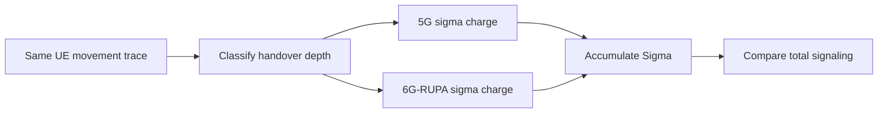

# Mobility Sigma Accounting

PLMN-GraphSim treats mobility signaling as a per-handover byte counter, denoted
$\sigma$. The simulator does not replay packet-level protocol messages. Instead,
each detected cell change is classified by depth, charged with the constant for that
depth, and accumulated over the run.

The same handover stream feeds both architectures. The only difference is the
per-event charge.



This page covers how to read the mobility scenario's output. The constants themselves
are derived in [The Signaling Cost Model](../../simulation-details/signaling-cost-model.md),
and the procedure behind each one is drawn out message by message in
[Handover Sequence Diagrams](../../simulation-details/handover-sequence-diagrams.md).

## Constants

| Event | 5G charge | 6G-RUPA charge | Simulator counters |
|---|---:|---:|---|
| $d=1$: serving edge UPF unchanged | 600 B | 200 B | `sigma_5g_xn`, `sigma_rupa_intra` |
| $d=2$: serving edge UPF or UL-CL changes, PSA pinned | 1150 B | 200 B | `sigma_5g_n2`, `sigma_rupa_inter` |
| $d=3$: PSA relocation, SSC mode 2 or 3 | 2200 to 2700 B | 200 B | not charged in routine SSC-1 runs |
| $d=4$: roaming entry, deployed HR re-establishment | 3250 B | 450 B | `sigma_roam_5g`, `sigma_roam_rupa` |
| $d=4$: roaming entry, idealized 5G border handover | 1300 B | 450 B | sensitivity mode |

Routine intra-PLMN mobility uses SSC mode 1: the PSA is pinned for the PDU session
lifetime. Crossing into another PSA region is therefore still a $d=2$ event in the
simulator; the cost surfaces as path stretch, not as PSA relocation. $d=3$ is a policy
decision rather than a geometric one, so it never fires on a routine run.

!!! warning "The counter names are historical, and they misname the classification"

    `sigma_5g_xn` and `sigma_5g_n2` suggest that $d=1$ means an Xn handover and $d=2$
    means an N2 handover. That is not what the simulator computes, and it is not how
    3GPP works. **Which RAN procedure runs (Xn or N2) and whether the serving UPF
    changes are independent axes.** TS 23.502 Sec. 4.9.1.2.4 is an Xn handover that
    *does* relocate the intermediate UPF, and Sec. 4.9.1.3 step 5 is conditional, so an
    N2 handover may well keep it.

    `src/Simulation/Handover.jl` classifies on the UPF, never on the RAN procedure:

    ```julia
    handover_level(topology, old_upf, new_upf) = old_upf == new_upf ? 1 : 2
    ```

    Read `sigma_5g_xn` as "depth-one bytes" and `sigma_5g_n2` as "depth-two bytes". The
    numbers are unaffected; only the names are wrong. See
    [Handover Sequence Diagrams](../../simulation-details/handover-sequence-diagrams.md)
    Sec. 2 for the full taxonomy.

## What Each Depth Charges

**$d=1$, serving edge UPF unchanged, 600 B.** The user moves between base stations
served by the same edge UPF. Only the N3 tunnel endpoint is rewritten, through one PFCP
Session Modification. Realized by TS 23.502 Sec. 4.9.1.2.2 over Xn, or by Sec. 4.9.1.3
with the conditional UPF selection skipped.

**$d=2$, serving edge UPF or UL-CL changes, PSA preserved, 1150 B.** The user crosses
into another edge UPF's region. The old session is released, a new one established, and
the path repointed at both ends, while the PSA and the UE's IP address stay pinned.
Realized by TS 23.502 Sec. 4.9.1.2.4 over Xn, which is the common case since
neighbouring gNBs usually do have Xn, or by Sec. 4.9.1.3 where there is no Xn.

**6G-RUPA, 200 B at every depth.** The moving node obtains a new location-dependent
address synonym under an aggregate that already exists. Active flows survive because
EFCP connections are keyed by connection-endpoint and port identifiers rather than by
the address. Core forwarding state is untouched, so $\Delta S_{\mathrm{core}} = 0$
whatever the depth.

!!! note "The 200 B is flat in depth, not in flow count"

    $\sigma_{\mathrm{RUPA}} = 50 + 150F$ for a node carrying $F$ active flows: 50 B of
    address and local-routing metadata plus a 150 B rebinding exchange per flow. The
    200 B headline is the $F=1$ case of the modelled eMBB profile. 5G rewrites one
    tunnel per session however many flows it carries, so a node holding many concurrent
    flows narrows and eventually inverts the signaling comparison, at $F \ge 4$ against
    $d=1$ and $F \ge 8$ against $d=2$. Depth flatness is unaffected either way.

## Roaming Entry

For deployed 5G Home-Routed roaming, the simulator models a border crossing as PLMN
reselection plus a new HR PDU-session establishment: 3250 B, and the 5G flow breaks.
The idealized connected-mode inter-PLMN handover, 1300 B with the session surviving, is
kept as a sensitivity mode because 3GPP does specify it even though it is not the
deployed default.

For 6G-RUPA, first entry into the internetwork layer costs 450 B, covering enrollment,
renumbering, and one internetwork advertisement. Later moves return to the flat 200 B
renumber, since enrollment is charged once rather than per event.

Both border semantics are reported, at 86.2 % and 65.4 % advantage respectively.

## Output Interpretation

The reported signaling totals are cumulative byte counters, summed over depth:

$$
\Sigma_{5\mathrm{G}} = \sigma_{5\mathrm{G}}^{d=1} + \sigma_{5\mathrm{G}}^{d=2} + \sigma_{5\mathrm{G}}^{\mathrm{roam}},
\qquad
\Sigma_{\mathrm{RUPA}} = \sigma_{\mathrm{RUPA}}^{d=1} + \sigma_{\mathrm{RUPA}}^{d=2} + \sigma_{\mathrm{RUPA}}^{\mathrm{roam}}.
$$

In the output columns those three 5G terms are `Sigma_5G_Xn`, `Sigma_5G_N2` and
`Sigma_Roam_5G`, with the naming caveat above.

The advantage is computed from totals, not from a hard-coded percentage:

$$
A = 1 - \frac{\Sigma_{\mathrm{RUPA}}}{\Sigma_{5\mathrm{G}}}.
$$

Because national intra-PLMN traces are dominated by depth-one handovers, the aggregate
advantage stays near the depth-one ratio $1 - 200/600 = 66.7\,\%$, rising slowly as the
depth-two share $\beta$ grows. $\beta$ is a property of how the deployment cuts its
regions, not of how fast the user travels, so a coarse UPF partition and a fine one
produce different aggregates from identical mobility.
