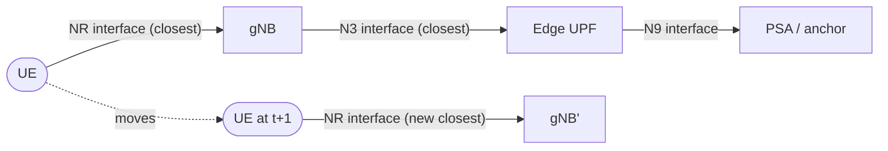

# Mobility Setup

The mobility scenario moves agents over the deployed topology and charges each cell
change. It is not a separate topology: it runs on top of the **two-tier** architecture,
because the depth-two and path-stretch results both need a serving edge UPF distinct
from the session anchor.



At every update interval each agent's position advances, the nearest gNB is recomputed,
and a cell change is classified by whether the serving edge UPF changed. That
classification is the only input to the charge; see
[Mobility Sigma Accounting](analysis.md).

## Configuration

Mobility is disabled by default, which leaves the stationary always-on eMBB behaviour of
the other scenarios untouched. Enable it in `config.toml`:

```toml title="config.toml"
[simulation]
scenario_mode = "two_tier"   # mobility results need an anchor distinct from the edge
num_centralized_upfs = 5     # PSAs

[simulation.mobility]
enabled = true
model = "random_waypoint"   # Options: "none", "random_waypoint"
update_interval = 1.0       # Simulation seconds between position updates and HO checks
speed_kmh = 5.0             # Pedestrian ~5, vehicular ~50, HSR ~250
pause_time = 0.0            # Reserved for future stateful waypoint model
max_jump_km = 1.0           # Cap per-tick displacement (sanity bound)
```

`update_interval` is the handover-detection granularity, not a cosmetic setting. A move
that crosses two cells inside one interval is seen as one handover, so a coarse interval
under-counts events at high speed. The sweeps use 1.0 s.

!!! warning "`config.toml` reaches only one of the two mobility models"

    `create_mobility_config` in `scripts/run_simulation.jl` accepts `none` and
    `random_waypoint`. Any other string, `gauss_markov` included, logs
    `Unknown mobility model ... falling back to NoMobility` and the run silently becomes
    stationary.

    The highway profile of the published sweeps uses `GaussMarkov`, which is reachable
    only by constructing `MobilityConfig` in Julia. The results on
    [the analysis page](analysis.md) therefore cannot be reproduced from `config.toml`
    alone: use the sweep runners below.

## Mobility Models

| Model | Constructor | Used for |
|---|---|---|
| `NoMobility` | `NoMobility()` | the stationary baseline of the other scenarios |
| `RandomWaypoint` | `RandomWaypoint(speed_kmh, pause_time, max_jump_km)` | pedestrian and urban profiles |
| `GaussMarkov` | `GaussMarkov(speed_kmh, alpha, sigma)` | the highway profile, where heading is correlated between ticks |

Random waypoint picks a destination and walks toward it, which is adequate while the
displacement per tick stays small relative to the cell size. Gauss-Markov keeps a
correlated heading, with `alpha` the memory coefficient, so a 120 km/h agent travels
like a vehicle on a road instead of reversing direction at random. Update equations are
in [Mobility Models](../../simulation-details/mobility-models.md).

## Running the Sweeps

The published results come from runner scripts that build the mobility config in code,
each dispatched through `main.jl`:

```bash
julia --project main.jl national_sweep                # 27 targets x 3 profiles = 81 runs
julia --project main.jl national_sweep france,canada  # country subset
julia --project main.jl national_sweep all 2000 300   # smoke: 2000 agents, 300 s
```

The three profiles are fixed in `runs/national_sweep.jl`:

```julia
const MODELS = [
    ("pedestrian", 5.0,   () -> RandomWaypoint(5.0, 0.0, 2.0)),
    ("urban",      50.0,  () -> RandomWaypoint(50.0, 0.0, 20.0)),
    ("highway",    120.0, () -> GaussMarkov(120.0, 0.85, 5.0)),
]
```

A fifth argument filters to one profile, so the 81 cells shard into independent jobs and
wall time tracks the longest single job rather than the sum of all of them:

```bash
julia --project main.jl national_sweep spain 0 1200 results/spain-highway.csv highway
```

Related runners: `anchor_sweep` varies the PSA count, which is the unpublished parameter
the path-stretch result depends on, and `federation` and `ntn` cover the multi-operator
and non-terrestrial boundaries.

## Targets

A target is a (country, field, operator) triple. **Field** is the base-station source:
the crowdsourced OpenCelliD field for every country, plus the official national registry
where one exists. Operator ids are real MNCs, so the same operator can be compared across
both fields, which is what makes the source dependence measurable rather than assumed.

| Country | Fields | Operators | Edge UPFs | PSAs | Targets |
|---|---|---|---:|---:|---:|
| Spain | OpenCelliD | Movistar, Orange, Vodafone | 52 | 5 | 3 |
| Portugal | OpenCelliD | MEO, Vodafone, NOS | 18 | 2 | 3 |
| USA | OpenCelliD, FCC ASR | Verizon, AT&T, T-Mobile | 817 | 5 | 4 |
| France | OpenCelliD, ANFR BNIR | Orange, SFR, Free, Bouygues | 96 | 5 | 8 |
| Canada | OpenCelliD, ISED | Telus, Rogers, Bell | 126 | 4 | 6 |
| Mexico | OpenCelliD | Telcel, Movistar, AT&T | 445 | 5 | 3 |

The FCC ASR field is a single `all-structures` target rather than a per-operator split,
because the registry records structures rather than licensee-tagged cells. France and
Canada carry every operator in both fields, which is what makes their two-field
comparison a controlled one.

Deployment parameters follow `runs/national.jl`: edge UPFs are second-level
administrative units above 50 000 inhabitants, PSAs are `round(population / 10M)`
clamped to $[2, 5]$, and the agent count is population times adoption divided by the
scale factor. Because the edge UPF count comes from the administrative partition rather
than from a tuned parameter, $\beta$ is inherited from how each country subdivides
itself, which is why it varies by a factor of thirty across the six countries while the
mobility profiles stay identical.

## Output

Each run appends one row per (target, profile) to `results/national-sweep.csv`, carrying
per-depth event counts, byte totals for both architectures, core writes, and anchor
distances. Column meanings and how to read them are on the
[analysis page](analysis.md).
