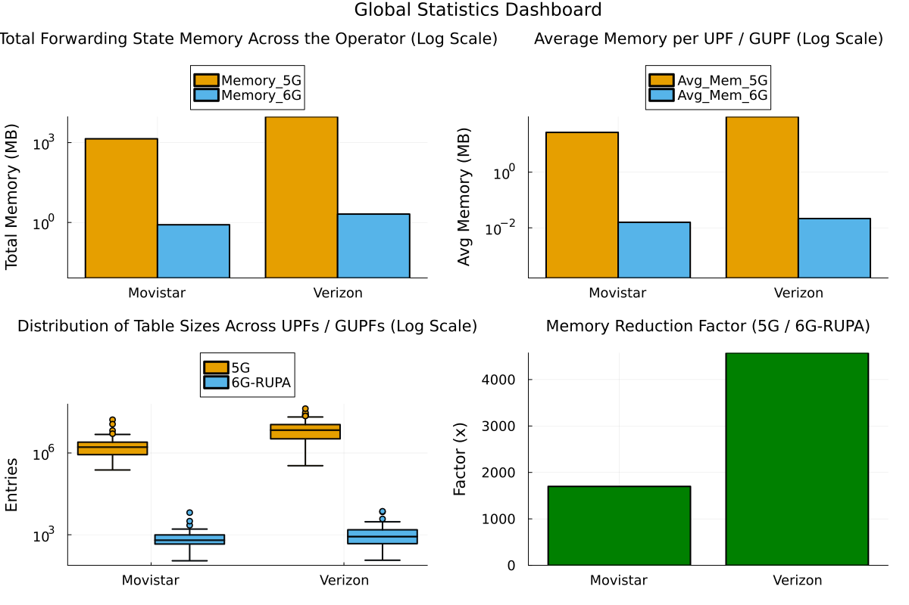
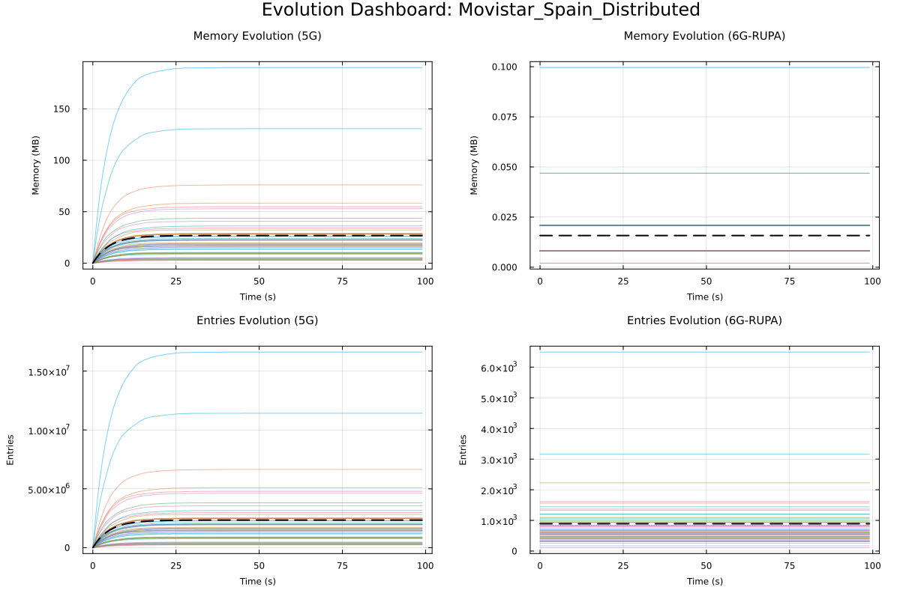
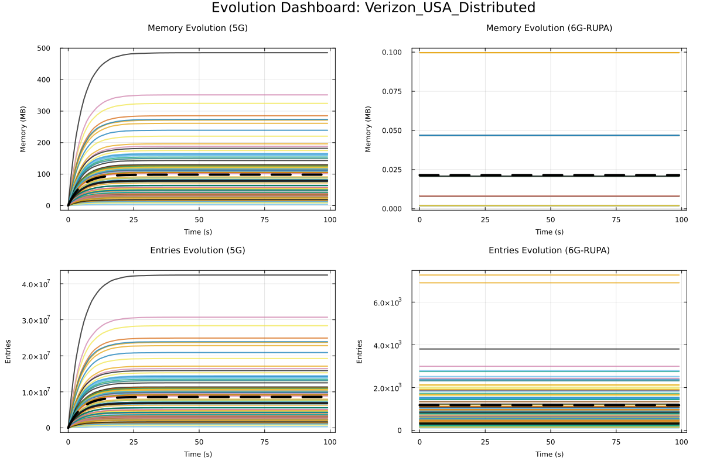

# Analysis

## Methodology

!!! info "Simulation Setup"
    - **Simulation Duration:** 100 time steps.
    - **Scenarios:**
        - **Movistar (Spain):** Smaller topology, moderate density.
        - **Verizon (USA):** Large topology, high density.

| Configuration  | Total 5G Mem (MB) | Total 6G-RUPA Mem (MB) | Reduction Factor | Max 5G Entries | Max 6G Entries |
| -------------- | ----------------- | ---------------------- | ---------------- | -------------- | -------------- |
| Movistar_Spain | 1395.31           | 0.82                   | **1698.9x**      | 16618000       | 6493           |
| Verizon_USA    | 9434.78           | 2.06                   | **4574.1x**      | 42424000       | 7265           |

The main take here is that if we compare the total memory used by the 5G architecture versus the 6G-RUPA architecture, we can see a massive reduction in memory usage, with reduction factors of **1698.9x** for Movistar Spain and **4574.1x** for Verizon USA.

Let's break down the results further.

## Global Statistics

### Understanding the Distribution

The box plot (bottom-left in the dashboard) illustrates the distribution of forwarding table sizes (number of entries) for every UPF (in 5G) and GUPF (in 6G-RUPA) in the simulation. 

The plot shows:

*   **Y-Axis (Log Scale):** The number of entries is plotted on a logarithmic scale to accommodate the massive difference between architectures.
*   **The Box:** Shows the middle 50% of the UPFs. The horizontal line inside is the median size.
*   **Whiskers & Outliers:** The whiskers show the range of typical values, while individual points represent outliers—UPFs with exceptionally high or low loads.

So the separation between the two groups is **essentially three orders of magnitude**. This means that even the largest GUPF in 6G-RUPA has a forwarding table size that is about 1000 times smaller than the smallest UPF in 5G.

## Simulation Evolution Analysis

??? note "A note on how memory is calculated"
    Memory is calculated based on the number of entries and the size of the data structures.

    *   **Entry Size:** We use a consistent **12 bytes per entry** for both architectures to ensure a fair comparison.
        *   **5G:** Derived from a 24-byte `ForwardingState5G` struct containing both Uplink and Downlink tunnels information (2 entries).
        *   **6G-RUPA:** Derived from a 12-byte `ForwardingEntry6GRUPA` struct.
    *   **Scaling:**
        *   **5G:** The number of entries is scaled by the `scale_factor` (1000 users per agent), as 5G maintains per-session state ($O(n)$).
        *   **6G-RUPA:** The number of entries is determined by the network topology and does not scale with the number of users ($O(1)$ complexity).

### Movistar Spain

### Verizon USA

## Some Insights

### Hardware Acceleration Becomes Impossible

The difference between 9.4 GB (5G) and 2 MB (6G-RUPA) is of three orders of magnitude. In software (x86, COTS servers), 9 GB is somehow manageable. But in high-speed networking hardware (ASICs, P4 switches, Routers), memory is scarce and expensive. So essentially 5G UPFs cannot essentially run in hardware at scale. On the other hand, 6G-RUPA would fit entirely inside of a L2 cache of a standard CPU or hte on-chip SRAM of a commodity switch.

s6G-RUPA enables wire-speed forwarding that is physically impossible with the 5G architecture at this scale.

### Zero-Marginal Cost of Users

6G-RUPA exhibits $O(1)$ state complexity with respect to user count. That basically means that adding the 10-millionth user to the 6G network **costs zero additional forwarding memory**. 5G has $O(N)$ state complexity, which essentially means that adding them to 5G costs **the same as the first user**

### Lookup speed (which translate to latency)

Memory size correlates directly with lookup speed, which in turn has to do with latency. The router has to find one specific ID among **42 million** entries (the "biggest" UPF at Verizon) whereas in 6G-RUPA the lookup is among **7 thousand** entries for the exact GUPF.

Not only that, but 5G by definition, needs to look up for an **exact match** algorithm. On the contrary 6G-RUPA will do the lookup using **topological prefix match** which is some sort of **longest prefix match**.
