# Analysis

## Methodology
- **Simulation Duration:** 100 time steps.
- **Scenarios:**
    - **Movistar (Spain):** Smaller topology, moderate density.
    - **Verizon (USA):** Large topology, high density.

| Configuration  | Total 5G Mem (MB) | Total 6G-RUPA Mem (MB) | Reduction Factor | Max 5G Entries | Max 6G Entries |
| -------------- | ----------------- | ---------------------- | ---------------- | -------------- | -------------- |
| Movistar_Spain | 1395.31           | 0.82                   | **1698.9x**      | 16618000       | 6493           |
| Verizon_USA    | 9434.78           | 2.06                   | **4574.1x**      | 42424000       | 7265           |

The main take here is that if we compare the total memory used by the 5G architecture versus the 6G-RUPA architecture, we can see a massive reduction in memory usage, with reduction factors of **1698.9x** for Movistar Spain and **4574.1x** for Verizon USA.

Let's break down the results further.

## Distribution of Table Sizes

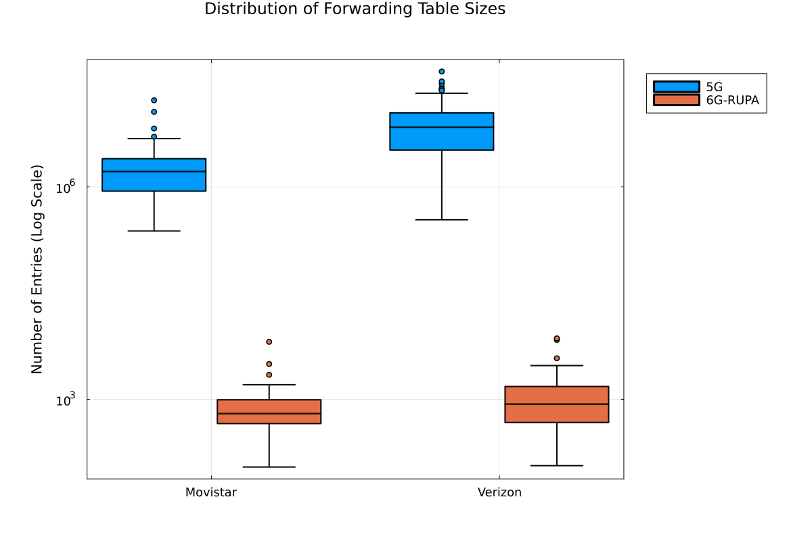

## Evolution of Network Memory per UPF and GUPF over time

!!! note
    Memory is calculated by multiplying every entry by the scaling factor and the size of each entry.
    * The scaling factor represent the number of users each agent represents in the simulation. So if an agent represents 100 users, each entry in the UPF table represents 100 PDU sessions.

### Global Comparison
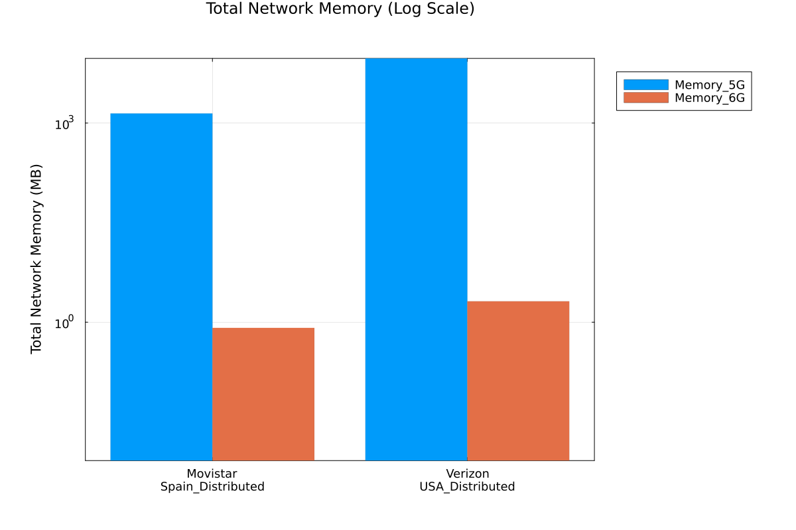
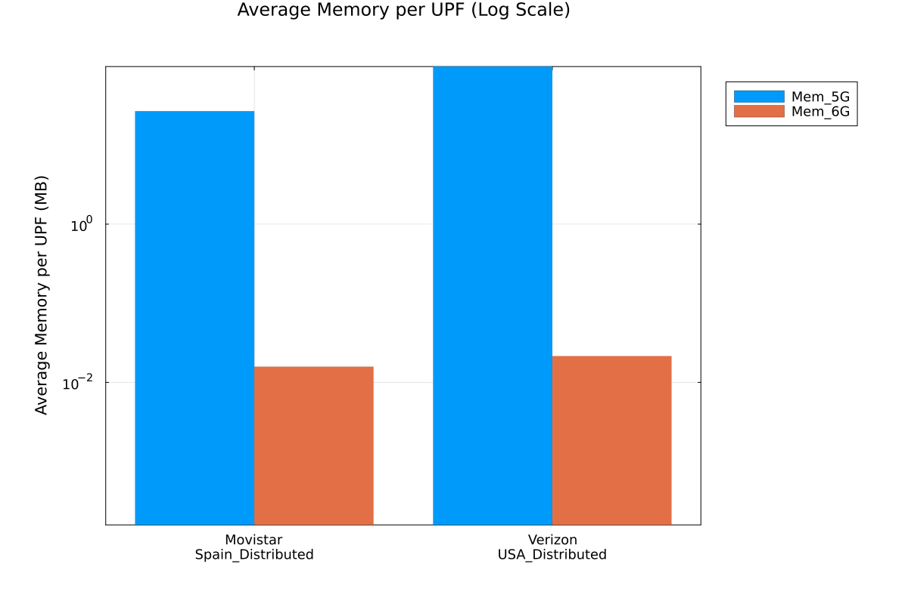

### Movistar Spain
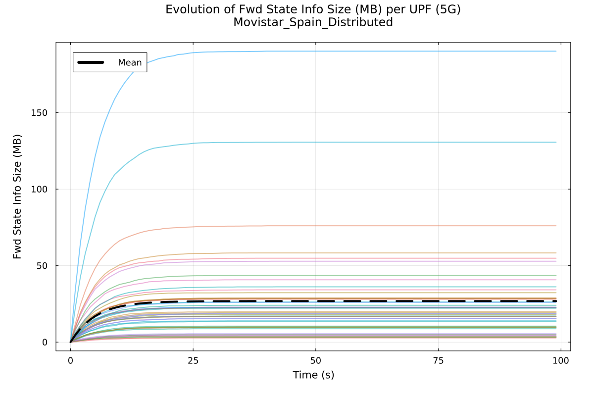
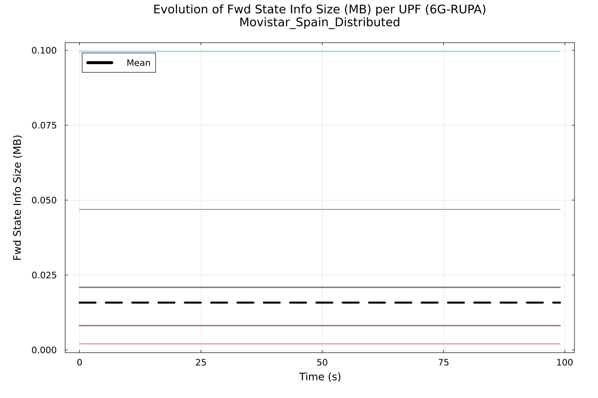

### Verizon USA
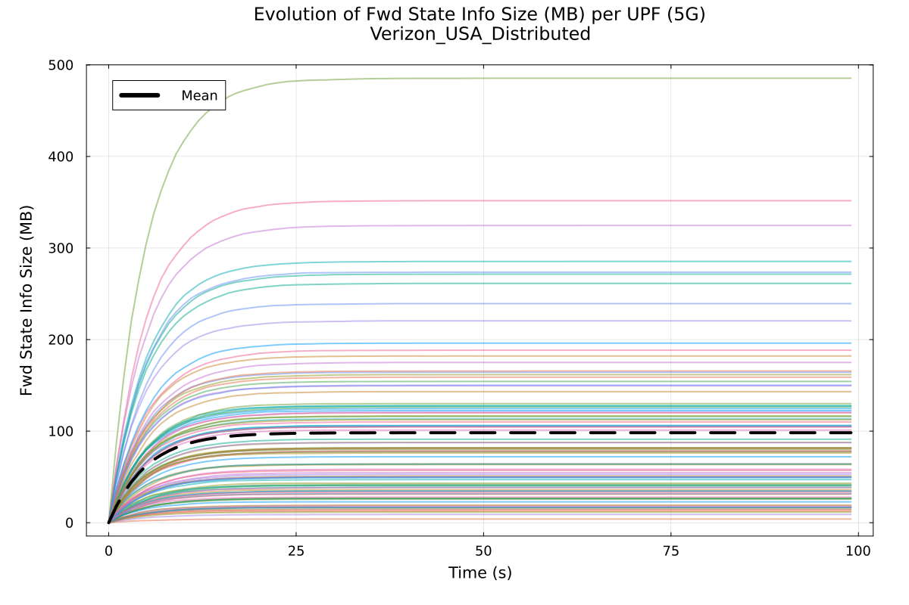
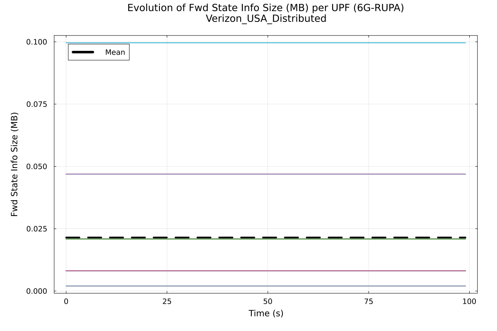

## Evolution of Number of Entries per UPF and GUPF over time

One could argue that memory can be optimized and is somehow implementation dependent, but the number of entries is a more abstract metric that indicates the actual state the UPFs need to maintain, no matter how you later implement the data structures.

### Movistar Spain
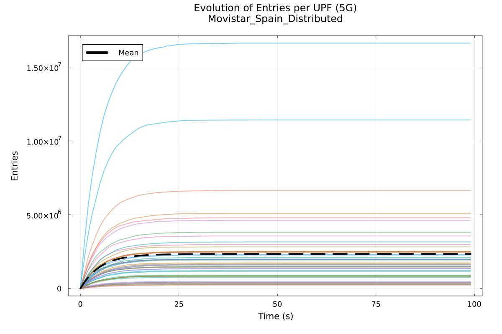
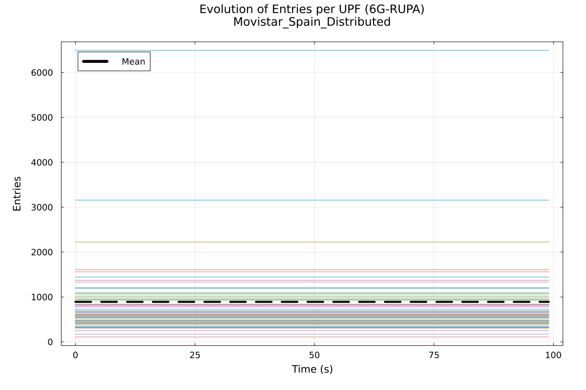

### Verizon USA
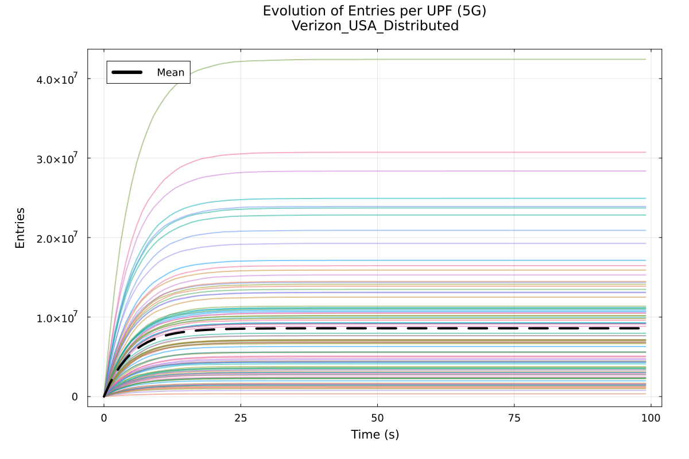
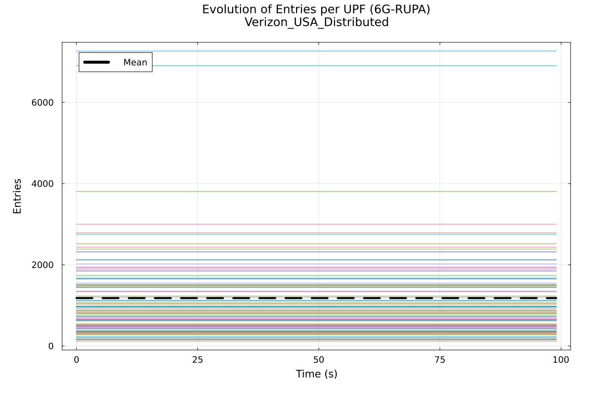

