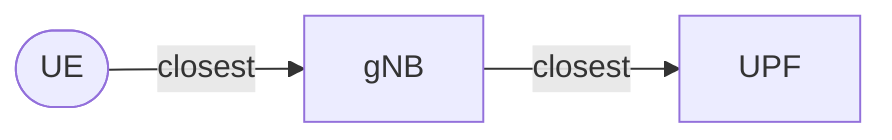

# Single-Tier Architecture Setup

The **Single-Tier Architecture** represents a network topology graph where Base Stations (gNBs) connect directly to distributed User Plane Functions (UPFs).

The elements are connected based on proximity:



!!! info "UPFs are not connected to each other"
    In this architecture, UPFs operate independently without interconnections. Each gNB connects to its nearest UPF based on geographic proximity.

## Configuration

To enable this mode, update your `config.toml`:

```toml title="config.toml"
[simulation]
# ... other settings ...

# Architecture Configuration
scenario_mode = "single_tier" 
```

## Defining Scenarios

You can define multiple scenarios per country, specifying the number of **UPFs** to generate and spread across the country. The simulator uses K-Means clustering to optimally place these UPFs based on agent density.

```toml title="config.toml"
[countries.spain.scenarios]
# Format: "Scenario Name" = Number of UPFs
"Spain Edge" = 52  # e.g., One per province
"Spain Regional" = 17 # e.g., One per autonomous community
```

## Visualization

When you run the simulation or the plotting script, the topology will look like this:

=== "Spain (Movistar)"
    
    **Topology Map**
    

    **Network Graph**
    

=== "USA (Verizon)"

    **Topology Map**
    

    **Network Graph**
    
