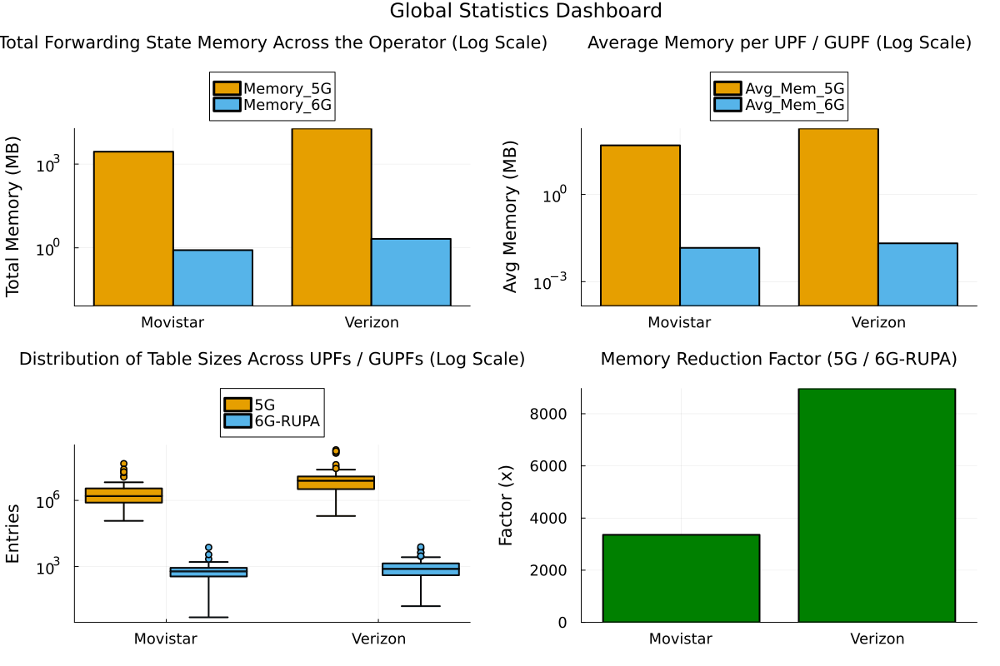
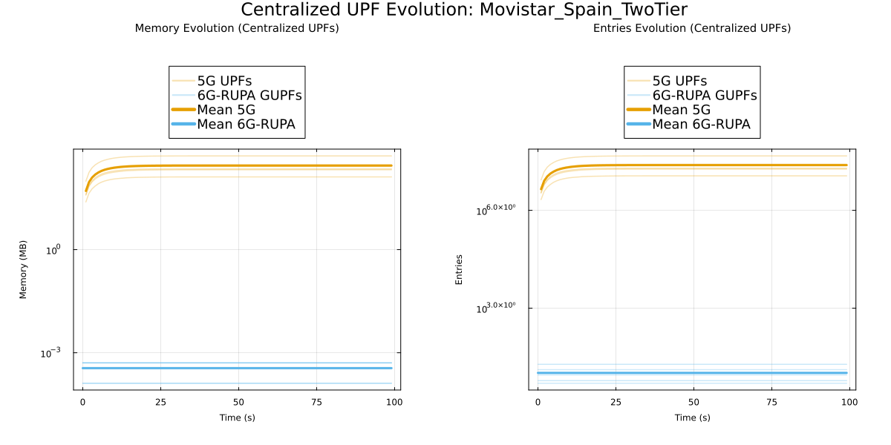
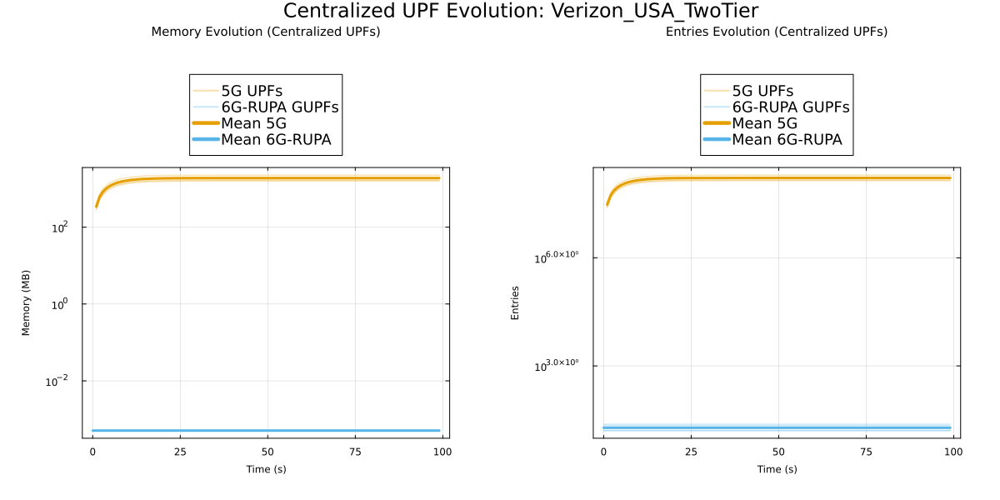
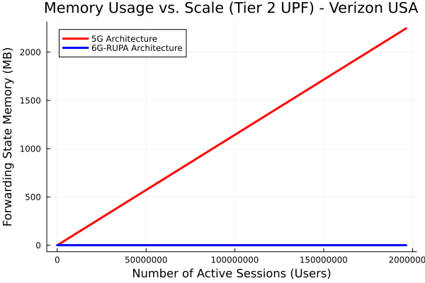
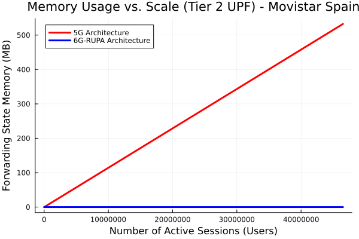

# Analysis

## Methodology

!!! info "Simulation Setup"
    - **Simulation Duration:** 100 time steps.
    - **Scenarios:**
        - **Movistar (:flag_es:):** Two-Tier architecture (Edge + Centralized).
        - **Vodafone (:flag_es:):** Two-Tier architecture (Edge + Centralized).
        - **Orange (:flag_es:):** Two-Tier architecture (Edge + Centralized).
        - **Verizon (:flag_us:):** Two-Tier architecture (Edge + Centralized).
        - **AT&T (:flag_us:):** Two-Tier architecture (Edge + Centralized).
        - **T-Mobile (:flag_us:):** Two-Tier architecture (Edge + Centralized).
        - **US Cellular (:flag_us:):** Two-Tier architecture (Edge + Centralized).
    

??? note "A note on how memory is calculated"
    Memory is calculated based on the number of entries and the size of the data structures.

    *   **Entry Size:** We use a consistent **12 bytes per entry** for both architectures to ensure a fair comparison.
        *   **5G:** Derived from a 24-byte `ForwardingState5G` struct containing both Uplink and Downlink tunnels information (2 entries).
        *   **6G-RUPA:** Derived from a 12-byte `ForwardingEntry6GRUPA` struct.
    *   **Scaling:**
        *   **5G:** The number of entries is scaled by the `scale_factor` (1000 users per agent), as 5G maintains per-session state ($O(n)$).
        *   **6G-RUPA:** The number of entries is determined by the network topology and does not scale with the number of users ($O(1)$ complexity).

## Results by Country

The reduction factors are even more extreme here than in the single-tier scenario because the Centralized UPFs in 5G must maintain state for *all* sessions in their region, whereas in 6G-RUPA, the core routers only need to know the topology of the core network, which is very small (19-24 nodes).

=== "Spain"

    ### Tier 1 (Edge)

    | Configuration            | Total 5G Mem (MB) | Total 6G-RUPA Mem (MB) | Reduction Factor | Max 5G Entries | Max 6G Entries |
    | :----------------------- | :---------------- | :--------------------- | :--------------- | :------------- | :------------- |
    | **Movistar_Spain_Tier1** | 1392.79           | 0.83                   | **1,682.2x**     | 19,096,000     | 7,412          |
    | **Orange_Spain_Tier1**   | 1390.09           | 0.66                   | **2,098.8x**     | 20,338,000     | 2,905          |
    | **Vodafone_Spain_Tier1** | 1390.14           | 0.44                   | **3,129.7x**     | 14,824,000     | 1,126          |

    ### Tier 2 (Centralized)

    | Configuration            | Total 5G Mem (MB) | Total 6G-RUPA Mem (MB) | Reduction Factor | Max 5G Entries | Max 6G Entries |
    | :----------------------- | :---------------- | :--------------------- | :--------------- | :------------- | :------------- |
    | **Movistar_Spain_Tier2** | 1392.79           | 0.0018                 | **781,824.4x**   | 46,526,000     | 19             |
    | **Orange_Spain_Tier2**   | 1390.09           | 0.0022                 | **643,823.3x**   | 45,780,000     | 17             |
    | **Vodafone_Spain_Tier2** | 1390.14           | 0.0025                 | **547,994.0x**   | 34,140,000     | 13             |

=== "USA"

    ### Tier 1 (Edge)

    | Configuration            | Total 5G Mem (MB) | Total 6G-RUPA Mem (MB) | Reduction Factor | Max 5G Entries | Max 6G Entries |
    | :----------------------- | :---------------- | :--------------------- | :--------------- | :------------- | :------------- |
    | **Att_USA_Tier1**        | 9429.20           | 2.73                   | **3,452.1x**     | 48,270,000     | 12,522         |
    | **Tmobile_USA_Tier1**    | 9426.11           | 4.82                   | **1,954.9x**     | 49,996,000     | 24,387         |
    | **Uscellular_USA_Tier1** | 9432.98           | 0.07                   | **135,303.0x**   | 98,692,000     | 146            |
    | **Verizon_USA_Tier1**    | 9431.10           | 2.10                   | **4,490.4x**     | 41,606,000     | 7,783          |

    ### Tier 2 (Centralized)

    | Configuration            | Total 5G Mem (MB) | Total 6G-RUPA Mem (MB) | Reduction Factor | Max 5G Entries | Max 6G Entries |
    | :----------------------- | :---------------- | :--------------------- | :--------------- | :------------- | :------------- |
    | **Att_USA_Tier2**        | 9429.20           | 0.0025                 | **3,717,004.5x** | 198,988,000    | 22             |
    | **Tmobile_USA_Tier2**    | 9426.11           | 0.0025                 | **3,715,786.5x** | 269,568,000    | 25             |
    | **Uscellular_USA_Tier2** | 9432.98           | 0.0025                 | **3,718,493.2x** | 365,244,000    | 30             |
    | **Verizon_USA_Tier2**    | 9431.10           | 0.0025                 | **3,717,753.4x** | 196,364,000    | 24             |

## Global Statistics

### Understanding the Distribution

The box plot (bottom-left in the dashboard) illustrates the distribution of forwarding table sizes (number of entries) for every UPF (in 5G) and GUPF (in 6G-RUPA) in the simulation. 

The plot shows:

*   **Y-Axis (Log Scale):** The number of entries is plotted on a logarithmic scale to accommodate the massive difference between architectures.
*   **The Box:** Shows the middle 50% of the UPFs. The horizontal line inside is the median size.
*   **Whiskers & Outliers:** The whiskers show the range of typical values, while individual points represent outliers—UPFs with exceptionally high or low loads.

## Detailed Evolution Analysis

??? note "A note on how memory is calculated"
    Memory is calculated based on the number of entries and the size of the data structures.

    *   **Entry Size:** We use a consistent **12 bytes per entry** for both architectures to ensure a fair comparison.
        *   **5G:** Derived from a 24-byte `ForwardingState5G` struct containing both Uplink and Downlink tunnels information (2 entries).
        *   **6G-RUPA:** Derived from a 12-byte `ForwardingEntry6GRUPA` struct.
    *   **Scaling:**
        *   **5G:** The number of entries is scaled by the `scale_factor` (1000 users per agent), as 5G maintains per-session state ($O(n)$).
        *   **6G-RUPA:** The number of entries is determined by the network topology and does not scale with the number of users ($O(1)$ complexity).

### Movistar Spain

### Verizon USA

## Key Insights

### No Bottleneck at the Centralized UPFs

In the Two-Tier architecture, the Centralized UPFs (Tier 2) act as massive aggregation points. In the 5G architecture, this creates a critical bottleneck because these nodes must maintain per-session state for millions of users across a vast region.

* **5G:** A single Centralized UPF in the Verizon scenario reaches **196 million entries**, requiring nearly **10 GB of high-speed memory**. This is physically impossible to implement in current high-speed switching hardware (ASICs), forcing these functions into slower software-based implementations.

* **6G-RUPA:** The corresponding GUPF in 6G-RUPA requires only **24 entries**. This is because it only needs to know the topology of the network (the Tier 1 routers) to route traffic.

### Complete Decoupling of State and Scale

The results demonstrate a complete decoupling of network scale (growth of number of UEs) from network state (forwarding state memory usage) in the core.

#### Memory Growth vs. User Scale

The following plots illustrate how memory usage in the Centralized UPF (Tier 2) evolves as the number of active sessions (users) increases.

**Verizon USA (Large Scale)**

**Movistar Spain (Medium Scale)**

*   **5G (Red Line):** Shows a linear increase in memory usage as more users connect. The memory footprint grows indefinitely with the number of sessions.
*   **6G-RUPA (Blue Line):** Remains perfectly flat. The memory usage is constant regardless of how many users are connected, as it only depends on the network topology.

*   **Unlimited Scalability:** You could add 100 million more users to the Verizon network, and the state in the 6G-RUPA Core GUPFs would remain exactly **24 entries**.

*   **Zero-Cost Core Expansion:** Expanding the capacity of the network by adding more users has literally **zero marginal cost** in terms of memory footprint for the core routers.

### Feasibility of All-Hardware Core

The difference between **196,000,000 entries** and **24 entries** is a reduction factor of over **3.7 million**. That means that in 6G-RUPA you can fit the entire forwarding table for a core router into a few **bytes** of register memory. This allows the core network to be built using ultra-fast, simple, and energy-efficient programmable switches (like P4 switches) without external memory, operating at terabits per second with deterministic latency.