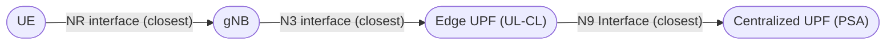

# Two-Tier Architecture Setup

The **Two-Tier Architecture** introduces a hierarchical User Plane structure, distinguishing between two kinds of UPFs:

* **Edge UPFs** (acting as Uplink Classifiers or UL-CLs) 
* **Centralized UPFs** (acting as PDU Session Anchors or PSAs).

This architecture models a more realistic national-wide mobile network deployment where traffic can be routed locally or forwarded to a regional/central anchor.



## Architecture Components

1.  **Edge UPF (UL-CL)**: Located close to the gNBs. Aggregates traffic from multiple base stations. In this simulation, these are the "Distributed UPFs" defined in the scenario.
2.  **Centralized UPF (PSA)**: Regional anchors. Each Edge UPF connects to the nearest Centralized UPF. These are defined by `num_centralized_upfs`.

## Configuration

To enable this mode, update your `config.toml`:

```toml title="config.toml"
[simulation]
# ... other settings ...

# Architecture Configuration
scenario_mode = "two_tier" 
num_centralized_upfs = 5 # Number of Centralized UPFs (PSAs) to generate
```

## Defining Scenarios

The scenario definition remains similar to the Single-Tier mode, but the "Number of UPFs" specified in the scenario now refers to the **Edge UPFs**.

```toml title="config.toml"
[countries.spain.scenarios]
# "Spain Distributed" = 52 Edge UPFs
"Spain Distributed" = 52 
```

The simulator performs **Hierarchical K-Means Clustering**:
1.  **gNBs -> Edge UPFs**: gNBs are clustered into *N* regions (where *N* is the scenario value, e.g., 52).
2.  **Edge UPFs -> Centralized UPFs**: The locations of the Edge UPFs are then clustered into `num_centralized_upfs` regions (e.g., 5) to place the PSAs.

## Visualization

The network graph will show two layers of UPF nodes: **Edge UPFs** (Black Squares) and **Centralized UPFs** (Purple Diamonds), connected by the **N9 Interface** (Purple Dashed Lines).

=== "Spain (Movistar)"
    
    **Topology Map**
    

    **Network Graph**
    

=== "USA (Verizon)"

    **Topology Map**
    

    **Network Graph**
    
