# Handover Sequence Diagrams

[The Signaling Cost Model](signaling-cost-model.md) gives each depth a constant and a
decomposition table. This page gives the procedure behind each of those constants as a
sequence diagram, so that a reader can check the byte count against the message set it
was derived from rather than taking the table on trust.

Every diagram is annotated with the clause it comes from. Specs are cited by official
clause only.

## 1. Notation

The clauses use positional prefixes that are not self-explaining.

**Source / target.** Any entity that can change during a move takes an `S-` / `T-` pair:

| Symbol | Meaning |
|---|---|
| **S-RAN** | Source NG-RAN, the gNB the UE is leaving |
| **T-RAN** | Target NG-RAN, the gNB it is moving to |
| **S-AMF / T-AMF** | source / target AMF, on inter-AMF handover |
| **S-UPF / T-UPF** | source / target UPF |
| **I-SMF** | intermediate SMF, inserted when the UE leaves the serving SMF's area; the SMF itself rarely changes intra-PLMN |

`NG-RAN` is the 5G radio access node: a gNB, or an ng-eNB, which is an LTE eNB attached
to the 5G core.

**Visited / home.** The roaming prefixes, used throughout Sec. 7:

| Symbol | Meaning |
|---|---|
| **V-** | visited: V-AMF, V-SMF, V-UPF, in the network the roamer is standing in |
| **H-** | home: H-SMF, H-UPF, back in the subscriber's own operator |

**UPF roles.** Not positional; these say what job the box is doing:

| Symbol | Meaning |
|---|---|
| **PSA** | PDU Session Anchor, holds the UE's IP address, the one SSC mode 1 pins |
| **I-UPF** | intermediate UPF, sits between gNB and PSA and serves a geographic area, the one that changes at $d=2$ |
| **UL CL / BP** | uplink classifier / branching point, the same box as an I-UPF wearing a traffic-splitting hat for edge computing; TS 23.502 Sec. 4.9.1.2.3 and Sec. 4.9.1.2.4 say so explicitly |

So $d=2$ is, in spec shorthand, *S-UPF to T-UPF, PSA unchanged*.

## 2. Taxonomy: Two Orthogonal Axes

**Xn versus N2, and whether the serving UPF changes, are independent axes.** Welding
them together is a claim the spec does not support, and it is the most common way to get
this classification wrong.

**Axis A, which RAN procedure runs.** Determined by whether the two gNBs have an Xn
interface and IP connectivity to the relevant UPF, not by anything in the core.

*   **Xn** is a direct logical interface between two gNBs (XnAP, TS 38.423). When it
    exists, S-RAN hands the UE over by talking straight to T-RAN; the core is told
    afterwards by a single N2 Path Switch Request, in effect "the UE is at me now,
    repoint the downlink". RAN-led, core notified after the fact, two NGAP messages.
*   **N2** is used when there is no Xn: different vendor islands, different security
    domains, no IP connectivity, a different AMF, a different PLMN. S-RAN cannot reach
    T-RAN directly, so it asks the core to broker: Handover Required, Handover Request,
    Acknowledge, Handover Command, Confirm, Notify, plus several
    `Nsmf_PDUSession_UpdateSMContext` round trips. Core-brokered, core involved before
    the UE is allowed to move, split into explicit preparation and execution phases.

The discriminator is therefore who brokers, and when. Not age, and not buffering.

Grounding: TS 23.502 Sec. 4.9.1.3 is titled *inter NG-RAN node N2 based handover without
Xn interface*; Sec. 4.9.1.2.4 says *if there is no IP connectivity between source UPF and
Target NG-RAN, it is assumed that the N2-based handover procedure in clause 4.9.1.3 shall
be used instead*.

!!! warning "N2 is not the legacy path"

    The direct-versus-brokered pair is inherited sideways from LTE (X2 versus S1
    handover), not generationally. Both members of each pair coexist within their own
    generation. N2 is the general mechanism; Xn is the optimization available when a
    direct link exists. N2 is mandatory for cases Xn structurally cannot serve: AMF
    change, PLMN change, no Xn between vendor islands, no IP connectivity to the source
    UPF.

!!! note "Data forwarding does not distinguish them either"

    In Xn handover the source gNB buffers and forwards to the target over Xn. In N2
    handover, forwarding is either direct, indicated by a *Direct Forwarding Path
    Availability* field, or, per TS 23.502 Sec. 4.9.1.3, *if a direct forwarding path is
    not available, indirect forwarding may be used*. In that case the SMF builds
    temporary forwarding tunnels through UPFs: steps 11b and 11d are extra N4 Session
    Modification messages telling T-UPF and S-UPF to allocate DL forwarding tunnels, and
    the forwarding UPF may even be a different UPF selected only for that purpose. That
    is more per-session state on the N2 path, and none of it is charged in the 1150 B
    constant.

**Axis B, whether the N3-terminating UPF changes.** A core/SMF decision, and the axis
that determines how much per-session tunnel state gets rewritten:

*   TS 23.502 Sec. 4.9.1.2.2 step 2: *the SMF determines whether the existing UPF can
    continue to serve the UE. If the existing UPF cannot continue to serve the UE, steps
    3-11 of clause 4.9.1.2.3 or 4.9.1.2.4 are performed depending on whether the existing
    UPF is a PDU Session Anchor.*
*   TS 23.502 Sec. 4.9.1.3.2 step 5 is **[Conditional]**: *SMF checks if the Target ID is
    within the service area of the UPF connecting to NG-RAN. If UE has moved out of the
    service area of the UPF connecting to NG-RAN, SMF selects a new intermediate UPF.*
    Step 7 then handles both branches.

So both directions are real: **Xn can change the I-UPF, and N2 can keep it.**

| | serving UPF unchanged | serving UPF changes |
|---|---|---|
| **Xn**, interface present | Sec. 4.9.1.2.2, $d=1$ | Sec. 4.9.1.2.3 insert / Sec. 4.9.1.2.4 re-allocate, $d=2$ |
| **N2**, no Xn interface | Sec. 4.9.1.3 with step 5 skipped, $d=1$ charge | Sec. 4.9.1.3 with T-UPF selected, $d=2$ |
| **PSA change** | not applicable | Sec. 4.3.5, SSC mode 2 or 3 only, not routine mobility |
| **PLMN change** | not applicable | reselection and a new HR PDU session, Sec. 4.3.2.2.2, flow breaks |

### 2.1 Four Walks

Same UE, same city, four consecutive moves. All four combinations are real:

| Move | Situation | Procedure | Depth |
|---|---|---|---|
| tower 1 to 2 | Xn neighbours, same I-UPF service area | Xn | $d=1$ |
| tower 2 to 3 | still Xn neighbours, but tower 3 is served by a different I-UPF | Xn | $d=2$ |
| tower 3 to 4 | different vendor island, no Xn, but same I-UPF area | N2 | $d=1$ |
| tower 4 to 5 | no Xn and a different I-UPF | N2 | $d=2$ |

Walks 2 and 3 are the proof: same procedure, different core cost; different procedure,
same core cost. Walk 2, TS 23.502 Sec. 4.9.1.2.4, is in a real deployment the common way
a $d=2$ event happens, since neighbouring gNBs usually do have Xn.

Classifying on Xn-versus-N2 would be like grading a database write by which network card
the request arrived on instead of by how many rows it touches. The interface is a
connectivity fact; the row count is the cost.

### 2.2 Which Axis the Model Uses

**The simulator classifies on axis B**, because the claim under test is about forwarding
state, and state is what axis B keys on. See `src/Simulation/Handover.jl`:
`handover_level(topology, old_upf, new_upf) = old_upf == new_upf ? 1 : 2`. It never
inspects the RAN procedure.

Depth names used from here on, keyed to what changes in the user plane:

*   $d=1$, serving UPF unchanged. Only the N3 tunnel endpoint moves.
*   $d=2$, serving/intermediate UPF changes, PSA preserved, SSC mode 1.
*   $d=3$, PSA or anchor changes. SSC mode 2 or 3 only, a policy decision rather than a
    geometric one.
*   $d=4$, PLMN changes. Not a handover in the deployed default, a session rebuild.

## 3. 5G $d=1$, Serving UPF Unchanged

Xn path switch, TS 23.502 Sec. 4.9.1.2.2. The SMF decides the existing UPF can continue
to serve, so only the AN tunnel endpoint is rewritten. $\sigma = 600$ B.

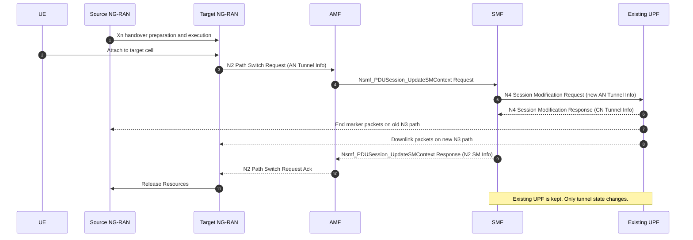

Spec anchors:

*   **TS 23.502 Sec. 4.9.1.2.2**, Xn handover without UPF re-allocation. The SMF decides
    to keep the existing UPF; the N2 Path Switch Request carries AN Tunnel Info; the AMF
    invokes `Nsmf_PDUSession_UpdateSMContext` per PDU session; the SMF sends N4 Session
    Modification to the UPF; the UPF sends end markers and starts downlink to the target;
    the AMF returns Path Switch Request Ack and the target releases source resources.
*   Constant: $\sigma_{5\mathrm{G}}(1) = 600$ B, decomposed in
    [The Signaling Cost Model](signaling-cost-model.md).

!!! note "Message naming in the $d=1$ table"

    The cost table names the 450 B RAN leg *NGAP Handover Request / Acknowledge*. In the
    Xn procedure the NGAP messages are N2 Path Switch Request / Path Switch Request
    Acknowledge (TS 38.413); Handover Request and Acknowledge are XnAP (TS 38.423),
    gNB to gNB. The magnitude is unaffected.

$d=1$ is also reachable over N2, Sec. 4.9.1.3 with the conditional step 5 skipped, which
costs more NGAP than the Xn path switch. The model charges 600 B either way.

## 4. 5G $d=2$ over Xn, Intermediate UPF Re-allocation

TS 23.502 Sec. 4.9.1.2.4. In a real deployment this is the common realization of $d=2$,
since neighbouring gNBs usually do have Xn. The UE moves out of the serving I-UPF's
service area, but the two gNBs still have Xn. The PSA is preserved; the intermediate UPF
is swapped.

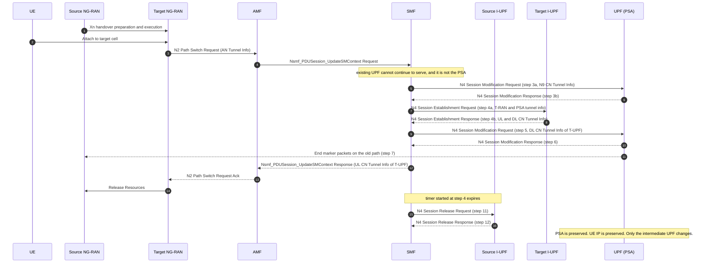

### 4.1 Why This Is 1150 B

Using the unit costs of [The Signaling Cost Model](signaling-cost-model.md), namely
Establishment 350, Modification round trip 100, Release 150, RAN leg 450:

| Message group | Steps | Spec | Bytes |
|---|---|---|---|
| NGAP path switch, Request and Ack | 1b, 8 to 11 | TS 38.413 | 450 |
| PFCP Session Modification at PSA, N9 tunnel info | 3a, 3b | TS 29.244 Sec. 7.5.4 | 100 |
| PFCP Session Establishment at Target I-UPF | 4a, 4b | TS 29.244 Sec. 7.5.2 | 350 |
| PFCP Session Modification at PSA, DL tunnel info | 5, 6 | TS 29.244 Sec. 7.5.4 | 100 |
| PFCP Session Release at Source I-UPF | 11, 12 | TS 29.244 Sec. 7.5.6 | 150 |
| **total** | | | **1150** |

The $d=2$ decomposition in the cost model, 450 NGAP plus 150 Release plus 350
Establishment plus 200 for two Modifications, is message for message the Sec. 4.9.1.2.4
set. The two Modifications are steps 3a/3b and 5/6; the Release is steps 11/12. The
constant was derived from the Xn-with-re-allocation procedure, and only the clause it
is cited against differs from the N2 realization in Sec. 5 below.

### 4.2 The Insertion Variant

TS 23.502 Sec. 4.9.1.2.3, the other side of the same branch: the N3-terminating UPF is
the PSA, and an I-UPF is inserted between the PSA and the new gNB. Identical message set
minus the Release, since there is no source I-UPF to release, plus a trailing N4 Session
Modification at the PSA to remove the old N3 CN tunnel once the step-5 timer expires:

$450 + 100 + 350 + 100 + 100 \approx 1100$ B, within 4 % of 1150, so it folds into $d=2$
without a separate constant.

Under UL-CL or Branching Point deployments the spec says the I-UPF is the UL CL or BP,
in the opening paragraphs of Sec. 4.9.1.2.3 and Sec. 4.9.1.2.4, so the UL-CL relocation
language in the cost model refers to the same box under a different role name.

Spec anchors:

*   **TS 23.502 Sec. 4.9.1.2.4**, Xn handover with re-allocation of intermediate UPF.
    Steps 1 to 4 as in Sec. 4.9.1.2.3 with I-UPF replaced by Target UPF, conditional PSA
    modification, source UPF release on timer expiry.
*   **TS 23.502 Sec. 4.9.1.2.3**, Xn handover with insertion of intermediate UPF. PSA
    modification, I-UPF establishment, PSA re-pointing, end markers, trailing N3 tunnel
    removal at step 12.
*   **TS 23.501 Sec. 6.3.3**, UPF selection criteria, why the SMF picks a new I-UPF at
    all.

## 5. 5G $d=2$ over N2, No Xn Interface

TS 23.502 Sec. 4.9.1.3. Same user-plane outcome as Sec. 4, the intermediate UPF is
swapped and the PSA and UE IP are preserved, but the RAN leg is a full N2 handover
because there is no Xn interface, or no IP connectivity to the source UPF.

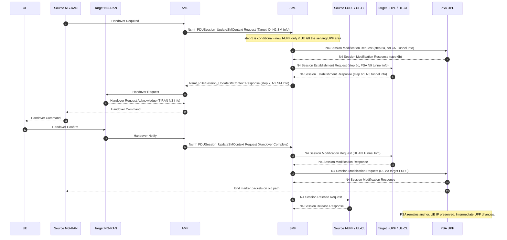

Spec anchors:

*   **TS 23.502 Sec. 4.9.1.3**, inter NG-RAN node N2 based handover, without Xn
    interface.
*   **TS 23.502 Sec. 4.9.1.3.2**, preparation. Step 5 **[Conditional]** new I-UPF
    selection only if the UE left the serving UPF's service area; steps 6a to 6d PSA
    modification and T-UPF establishment; step 7 returns N2 SM Information covering both
    branches.
*   **TS 23.502 Sec. 4.9.1.3.3**, execution. Handover Command, Confirm, Notify, N4
    updates at target UPF and PSA, source I-UPF released by N4 Session Release.
*   Constant: charged at the same 1150 B as Sec. 4.

!!! info "This procedure is under-charged, in 5G's favour"

    The NGAP leg here is much larger than the two-message Xn path switch: Handover
    Required, Handover Request, Request Acknowledge, Handover Command, Handover Confirm,
    Handover Notify, plus several `Nsmf_PDUSession_UpdateSMContext` round trips. The
    model charges the same 450 B RAN term as for Xn. So $d=2$-over-N2 events are
    under-charged, which makes the model conservative on exactly the procedure a sceptic
    would expect to have been inflated.

## 6. 5G $d=3$, Anchor Relocation

Not a geometric mobility depth. Under the SSC mode 1 baseline the anchor is pinned by
specification:

> TS 23.501 Sec. 5.6.9.2.1: *for a PDU Session of SSC mode 1, the UPF acting as PDU
> Session Anchor at the establishment of the PDU Session is maintained regardless of the
> access technology (e.g. Access Type and cells) a UE is successively using to access the
> network.*

That is why routine mobility never re-anchors: specified invariance, not implementation
difficulty. Two corollaries:

1.  **Moving into a different PSA region does not trigger this.** It stays $d=2$ with the
    original PSA kept, and the cost surfaces as path stretch, a hairpin back to the
    pinned anchor. That is why path stretch is a result at all, and why it grows at the
    roaming boundary. In the simulator, `crosses_psa_region` is a geometric marker only,
    never charged as a relocation.
2.  **PSA change is fully specified and does happen**, triggered by policy rather than by
    geometry. SSC mode 2 releases the session and has the UE establish a new one
    (Sec. 5.6.9.2.2); SSC mode 3 establishes the new anchor before releasing the old
    (Sec. 5.6.9.2.3, *the IP address is not preserved in this mode when the PDU Session
    Anchor changes*). Even under SSC mode 1, additional PSAs for local DN access may be
    released or allocated freely (Sec. 5.6.9.2.1), and the NOTE in Sec. 5.6.9.2 makes the
    addition or removal of an additional PSA independent of the SSC mode.

So *5G never changes the PSA* is wrong on two counts. The correct claim is that under SSC
mode 1 the anchor never moves for mobility reasons, which is precisely what forces the
path stretch.

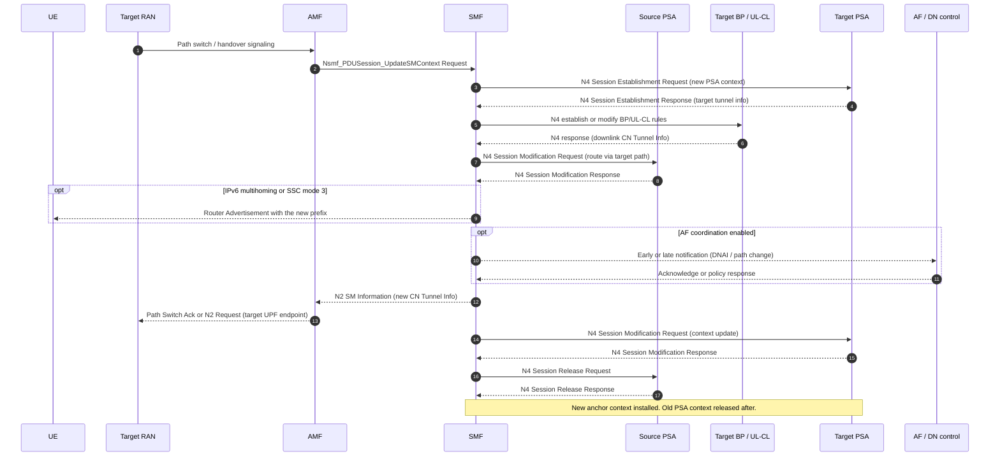

The 2200 to 2700 B range comes from TS 23.502 Sec. 4.3.5.1, which composes SSC-2
relocation from a full PDU Session Release plus a full PDU Session Establishment, with
Sec. 4.3.5.2 adding a Modification Command round trip for SSC-3. Because the procedure
contains a whole establishment, it cannot cost less than one.

Spec anchors:

*   **TS 23.501 Sec. 5.6.9.2.1, 5.6.9.2.2, 5.6.9.2.3**, SSC modes 1, 2 and 3.
*   **TS 23.502 Sec. 4.3.5.1 and 4.3.5.2**, SSC mode 2 and mode 3 PSA relocation, the
    source of the constant.
*   **TS 23.502 Sec. 4.3.5.3**, the SMF selects a new UPF as PSA and allocates a new IPv6
    prefix, configures branching point and PSAs over N4, notifies the UE of the new
    prefix and later releases the old prefix and old PSA context.
*   **TS 23.502 Sec. 4.3.5.7**, simultaneous BP/UL-CL and additional-PSA change.
*   **TS 23.502 Sec. 4.3.5.8**, handover path-switch followed by target PSA
    establishment.

## 7. 5G $d=4$, the Inter-PLMN Border

At a border the deployed default is not a handover. The UE reselects the PLMN and a new
Home-Routed PDU session is built from scratch, so the flow breaks and the accounting
context is rebuilt with it.

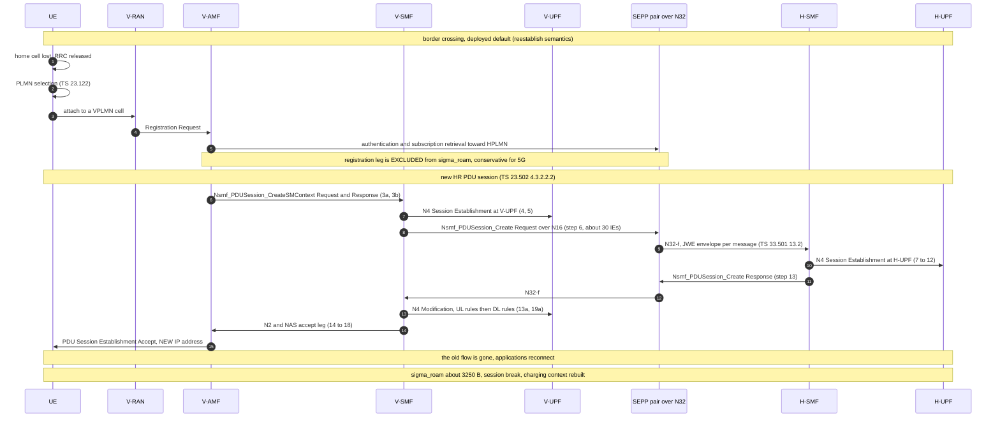

### 7.1 The Corner Case the Simulator Also Charges

3GPP does specify connected-mode inter-PLMN handover: TS 23.502 Sec. 4.9.1.2.2 step 0 and
Sec. 4.9.1.3.2 both contain explicit inter-PLMN handover handling, including target-AMF
relocation. It requires inter-operator configuration beyond the baseline roaming
agreement, so it is not the deployed default at a border, but 5G is not incapable of it.

The simulator therefore charges both semantics, in `src/Simulation/Handover.jl`:

*   `:reestablish`, the deployed default. 3250 B, session break recorded, accounting
    relocation recorded.
*   `:ideal_ho`, sensitivity. 1300 B, a $d=2$-class 1150 plus an N32 envelope of about
    150 B, and the session survives. This is 5G's best case, modelled deliberately.

Measured outcome: roaming $\sigma$ advantage 86.2 % deployed, 65.4 % under the idealized
case. Both are reported.

### 7.2 The Same Border in 6G-RUPA

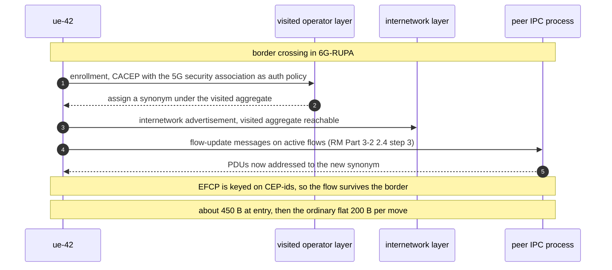

Spec anchors:

*   **TS 23.122**, PLMN selection, the reselection trigger at the border.
*   **TS 23.502 Sec. 4.2.2.2.2**, registration in the VPLMN, excluded from
    $\sigma_{\mathrm{roam}}$ by choice.
*   **TS 23.502 Sec. 4.3.2.2.2**, Home-Routed PDU session establishment. Step 6,
    `Nsmf_PDUSession_Create` over N16, is the heavyweight one at about 30 IEs.
*   **TS 33.501 Sec. 13.1 and 13.2**, SEPP, N32-c policy negotiation, N32-f JWE envelopes
    and PRINS. Sec. 13.2.1 calls N32 *the internetwork interconnect*.
*   **TS 23.501 Sec. 4.2.4**, roaming reference architectures.
*   **GSMA NG.113 Sec. 3.1.2, 5.1.2 to 5.1.3**, what operators actually agree to deploy.
*   **RINA RM Part 3-2 Sec. 2.4** for renumbering, the enrollment specs, and **CACEP
    Sec. 5.2.1** for authentication as an exchangeable policy.

## 8. 6G-RUPA, One Renumber for Every Depth Above

$d=1$, $d=2$, the SSC-2 or SSC-3 re-anchor equivalent, and the PLMN border are the same
address-synonym change in the relevant layer. The move assigns a new address under an
aggregate that already exists, so no core prefix is added or removed: the cost is flat
and $\Delta S_{\mathrm{core}} = 0$ regardless of how far the move reaches.

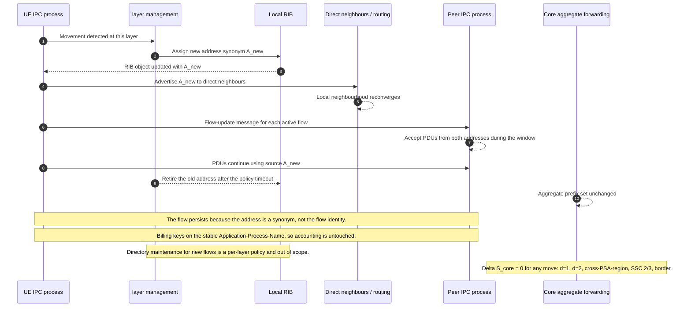

Spec anchors:

*   **RM Part 3-2 Sec. 2.4**, *Changing the Address of an IPC Process*. An address change
    is adding a new synonym; layer management assigns it and notifies the IPC process
    (step 2); FAIs notify peers and the process starts using the new source address
    (step 3); peers *expect PDUs [from] both source addresses for a time somewhat greater
    than 3t* and refuse the old only once data flows on the new address and 3t has
    expired (step 4); the old address is retired after several policy-determined routing
    updates with no reference to it (step 5). *This procedure has been implemented and
    demonstrated and does not lose data.*
*   **RM Part 3-2 Sec. 4**, *Mobility*. *Mobility is merely multihoming, where the points
    of attachment change more frequently*, solved *with no additional complexity and no
    specialized mobility protocols*.
*   **RM Part 3-1 Sec. 3.2**, the address is a layer-scoped, location-dependent synonym
    for an IPC process; identity is the application name.
*   **RM Part 3-1 Sec. 3.3**, topological names and routing. The core forwards on
    aggregate prefixes fixed by the deployed topology, so an inter-domain handover must
    not be modelled as installing or withdrawing a core prefix.
*   **RM Part 3-1 Sec. 3.4**, the directory, mapping name to address, is per-layer policy;
    active flows do not depend on it.
*   **EFCP spec**, connections are keyed on connection-endpoint and port-ids, not
    addresses.
*   **Grasa et al., EuCNC 2017 Sec. III**, renumbering walk-through and IRATI zero-loss
    measurements. **Grasa et al., WCNC**, end-to-end mobility validation. Two distinct
    papers.
*   Constant: $\sigma_{\mathrm{RUPA}} = 200$ B, flat.

## 9. 6G-RUPA, Single-Radio Handover

Sec. 8 assumes the make-before-break case, where the UE holds both attachments. This one
covers the single-radio case, where the UE must leave the source cell before it has the
target and is off the air for the radio gap.

Cast: `ue-42` is the UE IPC process, with a permanent AP-Name and address synonyms `a`
then `b`; `A` is the old edge forwarding node advertising aggregate `P_A`; `B` is the new
one advertising `P_B`; `S` is a correspondent IPCP with an EFCP connection keyed on
CEP-ids.

### 9.1 Cast and Addressing

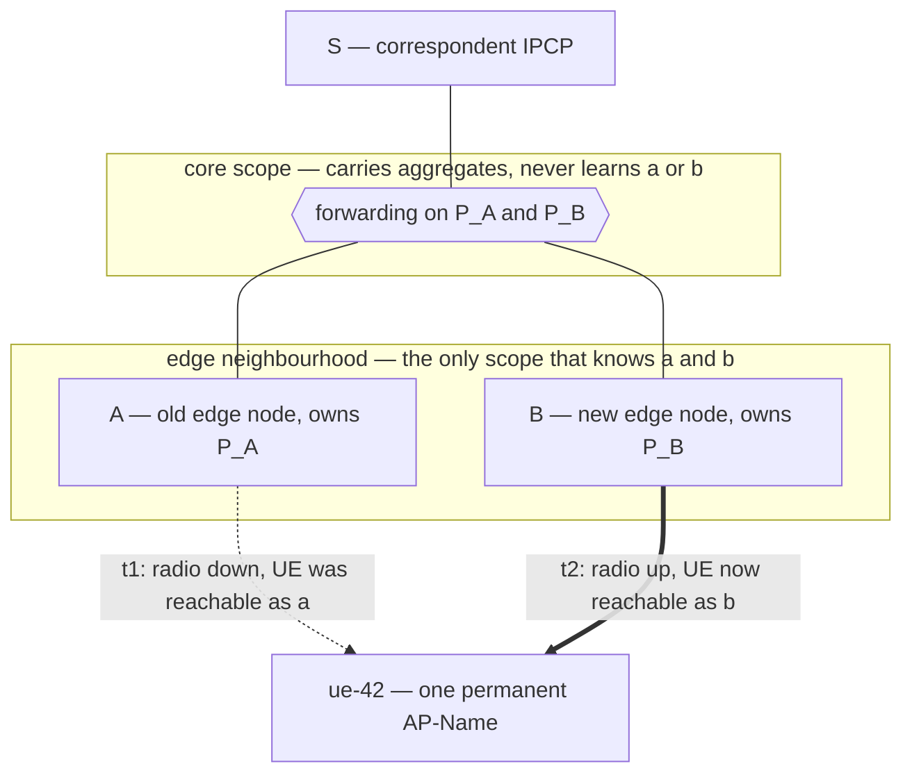

### 9.2 Timeline with the Two Policies

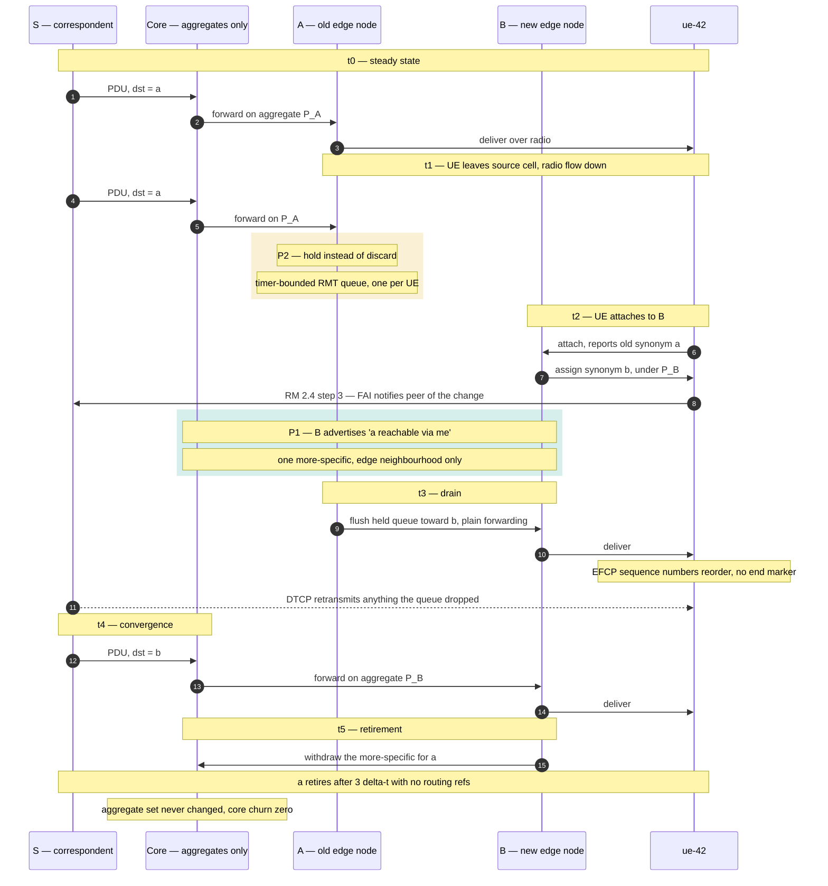

**P1, a routing policy of local scope.** During deprecation the old synonym is advertised
reachable via the new one. Plain forwarding, with no tunnel, encapsulation or label pair:
one more-specific under `P_A`, injected into the edge neighbourhood only, so the core
aggregate set is untouched and $\Delta S_{\mathrm{core}} = 0$ survives. Cheap variant:
the UE reports `a` at attach, so `B` folds *also serving `a` for 3Δt* into the renumber
advertisement it was already sending, adding a few bytes rather than a message.

**P2, a timer-bounded queueing policy.** The old edge's default, discard on
(N-1)-flow-down, becomes hold for T, with T of the order of the radio gap. It drains via
P1 once the binding is learned, and overflow is covered by DTCP retransmission because
the connection is keyed on CEP-ids.

### 9.3 Retirement Gates

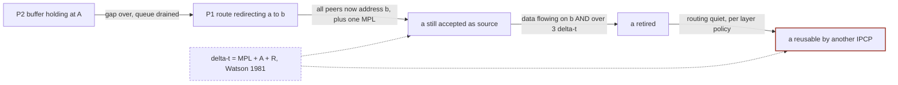

Nodes are states and edge labels are the condition to leave them. Timescales, not to
scale in the figure: buffer of the order of the radio gap, tens of ms; exception route
much shorter than 3Δt; source acceptance and reuse gated on more than 3Δt. Per RM
Part 2-1, Watson's theorem bounds MPL, A and R, and *after 2 to 3 ∆t of no traffic, all
synchronization state is no longer current*, with ∆t = MPL + A + R. The EFCP spec sets
the sender and receiver inactivity timers at 3∆t and 2∆t. MPL is *set for the DIF based
on the longest acyclic path in the graph of the DIF*, so a small-scope access layer gives
a short window: recursion bounds the cost of the policy.

Only the last gate is safety-critical, and it holds a name in a pool rather than
forwarding state. Retiring `a` is cheap; reassigning `a` to a different IPCP before the
network is quiet risks misdelivery of a delayed PDU. Accounting: edge exception state is
$O(\text{gap})$, pool reservation is $O(3Δt)$, and core state is 0 throughout.

### 9.4 Redirect as State Versus Redirect as Routing

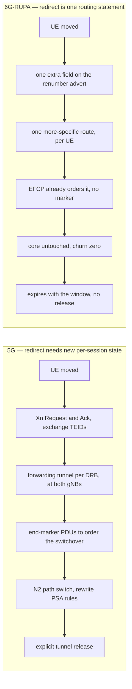

The root of the asymmetry is that 5G has no locator for the UE inside the network. The UE
IP is an identifier that no RAN or transport node forwards on; reachability is the chain
of per-session tunnel state keyed by transport IP and TEID, a locally allocated label with
no topological meaning. Nothing was ever advertised, so nothing can be re-advertised, and
redirect can only mean installing more per-session state. In 6G-RUPA the synonym is a
locator the layer actually routes on, so redirect is one routing statement.

Additional anchors: **TS 23.502 Sec. 4.9.1** for Xn data forwarding, end markers and path
switch; **TS 38.300** Rel-16 DAPS including the single-uplink variant; **TS 37.340** for
EN-DC and NR-DC; **RM Part 3-2 Sec. 2.4 steps 4 and 5**; **RM Part 2-1** for Watson; the
**EFCP spec** and **EFCP config**.

## 10. Known Conservatisms

Three independent under-charges point the same way, all in 5G's favour:

1.  **The N2 RAN leg is charged as if it were Xn** (Sec. 5). Six NGAP messages plus
    several `Nsmf_PDUSession_UpdateSMContext` round trips are charged the 450 B of a
    two-message Xn path switch.
2.  **Indirect data forwarding is not charged at all.** When N2 handover has no direct
    forwarding path, the SMF allocates temporary forwarding tunnels at the T-UPF and the
    S-UPF (TS 23.502 Sec. 4.9.1.3 steps 11b and 11d), possibly on a further UPF selected
    only for that purpose. That is extra per-session state and extra N4 messages, none of
    it in the 1150 B constant.
3.  **Make-before-break machinery is excluded on both sides**, which removes from 6G-RUPA
    a cost it would pay and from 5G a larger one.

One inconsistency worth stating rather than hiding: the PFCP Session Modification unit
cost differs between the two decomposition tables. The $d=1$ table charges Request 100
plus Response 50, so 150 per round trip, while the $d=2$ table charges 100 per round trip.
Harmonizing at 150 gives $d=1$ 600 B unchanged and $d=2$ 1250 B; harmonizing at 100 gives
$d=1$ 550 B and $d=2$ 1150 B unchanged. Either choice moves the aggregate advantage by
well under three percentage points, and the aggregate is computable from the recorded
per-depth event counts, so resolving it is a recomputation rather than a re-run.
