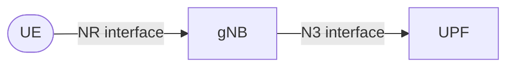
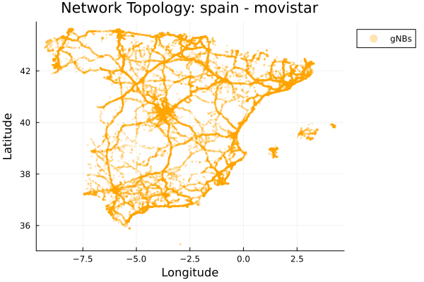
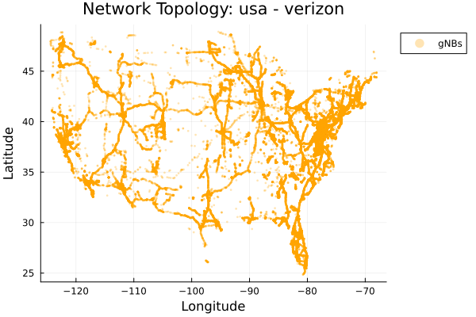
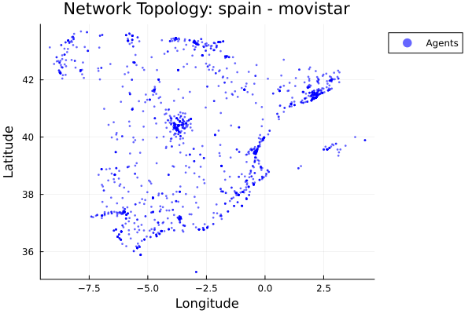
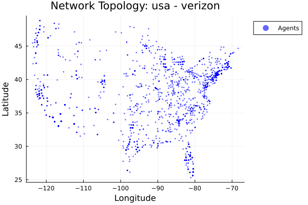
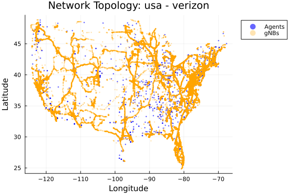
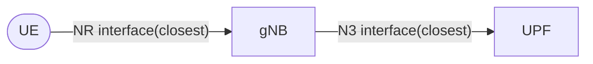

# In a Nutshell

The goal of the simulator is to generate a network graph that somehow is close to what national-level mobile network operators have. That has to look more or less like this:

Operators are very confidential about the deployment of their network topologies, so we have to rely on publicly available datasets and reasonable assumptions to create synthetic but realistic topologies.

Let's start building the graph for what we know quite precisely: the locations of the base stations (gNBs).

## Loading gNBs

The gNB locations are obtained from [OpenCellID](https://opencellid.org/), which is a public dataset that provides data about cell towers worldwide. Of course it's not 100% what operators have, but it gives us ballpark numbers to get a sense about where are mostly the gNBs.

The dataset comes with the gNB latitude and longitude, so we can plot them on a map to visualize their distribution.

=== "Spain (Movistar) :flag_es:"

    **Movistar's gNB Distribution in Spain**
    
    

=== "USA (Verizon) :flag_us:"

    **Verizon's gNB Distribution in USA**
    
    

## Loading Agents

Great, now we have the gNBs. Now we need to add the users that will connect to these gNBS.

In the simulator we call them "agents". Agents represent similar users (e.g., 1 agent = 1000 users in a closeby location) that are distributed across municipalities within a country. That way we can simulate a large number of users without having to model each individual user.

So to distribute the agents we need two things:

1. The list of municipalities with their population.
2. The geographic boundaries (polygons) of each municipality to ensure agents are placed within valid areas.

With that information, we can distribute the agents proportionally to the population of each municipality, ensuring a realistic distribution of users across the country.

??? note "Data Preparation is a bit tricky..."
    This is a but tricky because every country provides this data in a different format and differnt source.
    
    For example, in Spain we use data from the INE (Instituto Nacional de Estadística), while in the USA we use data from the Census Bureau. More details about how to prepare the data for each country can be found in the [Agents documentation](agents/getting-data-ready.md).

??? warning "Sorry..."
    Sorry Alaskans, Hawaiians and people from the Canary Islands, the study of this gets easier if we don't have to deal a lot with un-connected regions, they are removed from the map :)

But once we have the agents distributed, we can visualize them on a map:

=== "Spain (Movistar) :flag_es:"

    **Population Distribution in Spain (1 dot = 1000 people)**
    
    

=== "USA (Verizon) :flag_us:"

    **Population Distribution in USA (1 dot = 1000 people)**
    
    

And if we put them alongside the gNBs to see how well they are covered.

=== "Spain (Movistar) :flag_es:"

    **gNBs and Agents in Spain**
    
    

=== "USA (Verizon) :flag_us:"

    **gNBs and Agents in USA**
    
    

## Distributing UPFs

Until here all the data is publicly available.

Remember that our goal is to have a graph such as 

We have the **UEs (agents)** and the **gNBs**, but we still need to add the **UPFs**. So what we do here is to let the simulator place the UPFs in the optimal way taking in account the gNB locations. So we are **optimizing the placement of UPFs to have the minimum squared euclidean distance to the gNBs**. More details on that can be found in the [K-means](simulation-details/k-means.md) section.

!!! note 
    Note that for simplicity **we are not taking in account the orography, road distances, or other real-world** factors that operators would consider when deploying UPFs. However, this approach gives us a reasonable approximation of how UPFs could be distributed in a real network.

!!! tip
    The number of UPFs to deploy **is configurable**. You basically tell the simulator how many UPFs to deploy, and it will place them optimally. You can experiment with different numbers to see how it affects the network topology

A naive amount of UPFs to be deployed (at least to start) could be like:

* :flag_es: Spain: **52 UPFs**. 1 UPF per province, minus Las Palmas and Santa Cruz de Tenerife plus Ceuta and Melilla)

* :flag_us: USA: **96 UPFs**. Is the number of counties in the USA with more than 100k inhabitants.

But you can try with more or less UPFs to see how it affects the network topology.

With this numbers, we get:

=== "Spain (Movistar) :flag_es:"

    **gNBs, Agents and UPFs in Spain**
    
    

=== "USA (Verizon) :flag_us:"

    **gNBs, Agents and UPFs in USA**
    
    

## Connecting the Dots

Finally, we just need to conenct the dots. Remember our simple graph:

We connect the agents to the closest gNB, and each gNB to the closest UPF. This way we complete the network graph.

!!! note "Closest in terms of Haversine Distance"
    The *closest* actually means the minimum haversine distance between two geographic coordinates (latitude and longitude).

And that's it! We have a synthetic but realistic network topology that we can use to simulate and analyze the performance of 5G networks at a scale.

=== "Spain (Movistar) :flag_es:"

    **Graph of the Network Topology in Spain**
    
    

=== "USA (Verizon) :flag_us:"

    **Graph of the Network Topology in USA**
    
    

## Next Steps

This was a very high-level overview of how the simulator builds the network topology. We call this scenario the "**single-tier**" scenario because **all UPFs are distributed across the territory**, but the UPFs are not interconnected among them. 

This is not realistic for large operators that would have a more hierarchical structure with some centralized UPFs.

[Check the Scenarios...](../../scenarios/index.md){ .md-button .md-button--primary }

<!-- * For more information on how to set up this scenario refer to the [Single-Tier Scenario](simulation-details/single-tier-scenario.md) documentation.

* For more information on the hierarchical scenario with centralized UPFs refer to the [Two-Tier Scenario](simulation-details/two-tier-scenario.md) documentation.

* For more information on how the simulation works internally refer to the [Simulation Details](simulation-details/overview.md) documentation.

* For more information on how to extend the simulator for other countries, refer to the [Agents](agents/getting-data-ready.md) documentation. -->