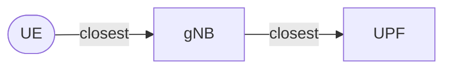

# UPF Placement Strategy (K-Means)

The simulator uses the **K-Means clustering algorithm** to determine the optimal locations for User Plane Functions (UPFs). 

A key design decision in this process is choosing the input data for the clustering: should we cluster based on **Agent (User) Density** or **gNB (Base Station) Density**?

We have chosen **gNB Density** as the primary metric for UPF placement.

## Why gNB Density?

While it might seem intuitive to place UPFs where the users are (Agent Density), using gNB density provides a more realistic and robust network topology for several reasons:

### 1. Network Topology Constraints

In cellular networks, traffic follows a strict hierarchy:

A user cannot bypass the gNB to connect directly to a UPF. 

Therefore, the UPF acts as an aggregation point for a cluster of gNBs, not directly for users. Placing the UPF at the geometric "center of mass" of the gNBs minimizes the aggregate backhaul latency (the physical cable distance from the towers to the processing hub).

### 2. Infrastructure Stability

**gNB locations are static**, whereas **User locations are dynamic**. 

*   **gNBs**: Once deployed, cell towers rarely move. They represent the fixed access layer of the network.
*   **Users**: People move, commute, and travel. Their distribution changes throughout the day (e.g., residential vs. commercial areas).

Planning fixed core infrastructure (UPFs) based on other fixed infrastructure (gNBs) is more practical than planning it based on a stochastic snapshot of moving users.

### 3. Correlation

There is already a strong correlation between gNB density and population density. Mobile operators deploy more base stations in densely populated areas to handle capacity. Therefore, clustering by gNB density implicitly accounts for population density, but respects the physical constraints of the Radio Access Network (RAN).

## The Algorithm

The placement process works as follows:

1.  **Filter**: Select all gNBs belonging to the specific operator (MCC/MNC) within the simulation boundaries.

2.  **Cluster**: Apply the K-Means algorithm to the coordinates of these gNBs, where $K$ is the number of desired UPFs (defined in `config.toml`).

3.  **Assign**: The centroids of the resulting clusters become the locations of the UPFs.

4.  **Map**: Each gNB is assigned to the nearest UPF centroid, creating the logical link between the Access Network and the Core Network.
