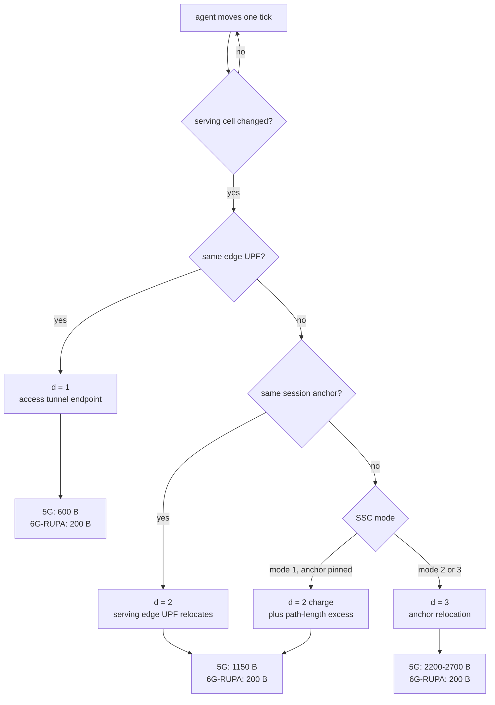
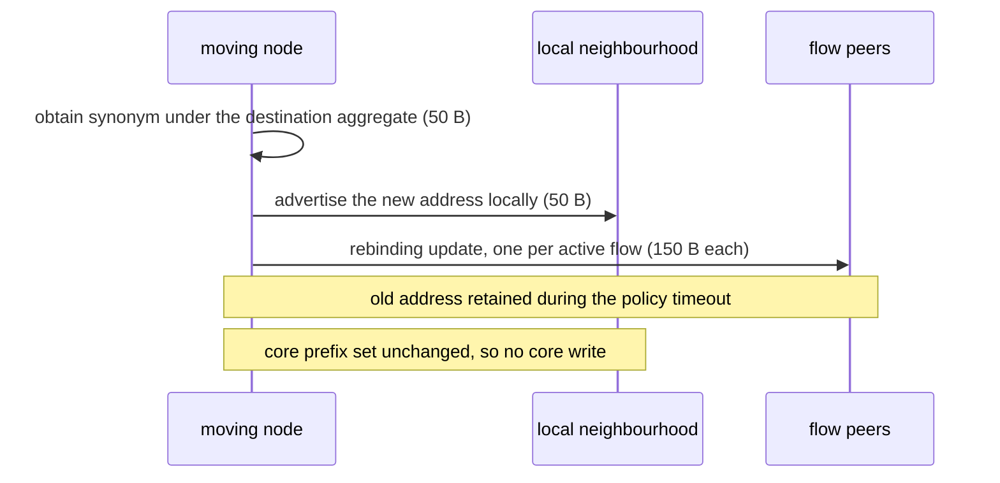
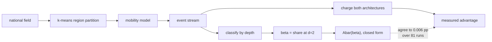

# The Signaling Cost Model

The simulator does not measure signaling. It counts mobility events and charges each
one a constant taken from the relevant 3GPP procedure or 6G-RUPA operation. This page
gives every constant, its decomposition, and the clause it comes from, so that a
reader can recompute or contest any of them without rerunning anything.

That split is deliberate and is what makes the results checkable: simulation supplies
the **event mix**, analysis supplies the **per-event cost**, and the two never touch.

## What $\sigma$ Is

$\sigma$ is the transient control-plane traffic exchanged to complete one mobility
event, in bytes per event. It is not:

*   **steady-state memory**, which is forwarding-table occupancy rather than messages;
*   **core forwarding-state churn** $\Delta S_{\mathrm{core}}$, a separate per-event
    quantity counting per-session writes;
*   **the radio leg**. RRC reconfiguration and random access are identical under both
    architectures over the same NG-RAN, so they are excluded from both sides. Their
    inclusion would add the same constant to numerator and denominator.

All values are information-element-level estimates from the named clause, not packet
captures. The headline is a ratio, so it survives any uniform rescaling of the set.

## Where the Charge Is Decided

The same event stream feeds both columns. Only the charge differs, which is why the
ratio is insensitive to the mobility model while the absolute totals are not.

## 5G: A Procedure Family That Grows With Reach

Each depth rewrites a different amount of per-session tunnel state, so each has its
own procedure and its own cost.

### $d=1$, access tunnel endpoint, 600 B

The user moves between base stations served by the same edge UPF. Only the N3 tunnel
endpoint is updated, through one PFCP Session Modification. Procedure: TS 23.502
Sec. 4.9.1.2.2.

| Message | Spec | Bytes |
|---|---|---|
| NGAP Handover Request | TS 38.413 | 250 |
| NGAP Handover Request Acknowledge | TS 38.413 | 200 |
| PFCP Session Modification Request | TS 29.244 Sec. 7.5.4 | 100 |
| PFCP Session Modification Response | TS 29.244 Sec. 7.5.4 | 50 |
| **total** | | **600** |

### $d=2$, serving edge UPF relocation, 1150 B

The user crosses into another edge UPF's region. The uplink classifier changes while
the anchor and the UE's IP address are preserved, so the old session must be released,
a new one established, and the path repointed at both ends. Procedure: TS 23.502
Sec. 4.9.1.3.2 to 3.3.

| Message group | Spec | Bytes |
|---|---|---|
| NGAP N2 handover signaling | TS 38.413 | 450 |
| PFCP Session Release, old UL-CL | TS 29.244 Sec. 7.5.6 | 150 |
| PFCP Session Establishment, new UL-CL | TS 29.244 Sec. 7.5.2 | 350 |
| PFCP Session Modification $\times 2$ | TS 29.244 Sec. 7.5.4 | 200 |
| **total** | | **1150** |

### $d=3$, anchor relocation, 2200 to 2700 B

A new anchor is established, the old one released, and the user gets a new address.
Under SSC mode 1 this **never fires on geometric mobility**, because the anchor is
pinned; it is a deliberate re-anchor. The simulator therefore does not charge it per
anchor-region crossing. Crossing a pinned anchor's region boundary costs path length,
not signaling, which is what $\rho$ measures. Procedure: TS 23.502 Sec. 4.3.5,
TS 23.501 Sec. 5.6.9.

### $d=4$, roaming entry, 3250 B

Home-Routed entry anchors the visited session back to the home network. Decomposition:
session-management create over N16 (600 B), N4 establishment in both networks (700 B),
N9 path setup (700 B), N32-f security envelopes (800 B), N2 and NAS accept leg (450 B).
Roaming registration is excluded, which is conservative in 5G's favour. Architecture:
TS 23.501 Sec. 4.2.4; transaction: TS 23.502 Sec. 4.3.2.2.2; security: TS 33.501
Sec. 13; deployment: GSMA NG.113 Sec. 3.1.2 and 5.1.2 to 5.1.3.

## 6G-RUPA: One Operation at Every Depth

A renumbering is not a handover procedure. It is the architecture's native
assign-a-new-address primitive, and it is the same operation at every depth.

| Component | Source | Bytes |
|---|---|---|
| new synonym and local name-space update | RINA RM Part 3-2 Sec. 2.4 | 50 |
| rebinding update per active flow | Grasa et al. Sec. III | 150 |
| **total, one active flow** | | **200** |

Two properties follow, and both are load-bearing:

*   **No term depends on depth.** The advertisement reaches only the neighbourhood the
    node moved into, because routing to the old and the new address coincides
    everywhere upstream of it. So the same 200 B applies at $d=1$, $d=2$ and the
    anchor-relocation equivalent alike.
*   **No term installs core state.** The destination aggregate is fixed by topology and
    already advertised; the node takes an address *under* it. This is why
    $\Delta S_{\mathrm{core}} = 0$ rather than merely small.

First entry into a layer adds one enrollment exchange, about 450 B in total, charged
once and not per event.

### The per-flow term

$\sigma_{\mathrm{RUPA}} = 50 + 150F$ for a node carrying $F$ active flows. Flatness in
depth is unaffected, but the comparison against 5G is not flat in $F$: 5G rewrites one
tunnel per session however many flows it carries. At $F \ge 4$ a renumbering exceeds
the 600 B depth-one procedure, and at $F \ge 8$ the 1150 B depth-two one. The scenarios
here assume the one to two active sessions per user of the modelled eMBB profile.
A device holding many concurrent flows inverts the signaling comparison, though neither
$\Delta S_{\mathrm{core}}$ nor $\rho$ depends on $F$.

## From Per-Event Cost to Aggregate Advantage

Under SSC mode 1 only the first two depths occur, so a deployment's whole event mix
reduces to one number: $\beta$, the share of events that reach the serving edge UPF.

$$\bar{A}(\beta) = 1 - \frac{\sigma_{\mathrm{RUPA}}}{(1-\beta)\,\sigma_{5G}(1) + \beta\,\sigma_{5G}(2)} = 1 - \frac{200}{600 + 550\beta}$$

Read it as the fraction of control bytes 6G-RUPA does not send. The denominator is what
an average handover costs 5G on a deployment whose mix is $\beta$; the numerator is what
the same handover costs 6G-RUPA, which is the same everywhere.

Because $\bar{A}$ is monotone in $\beta$ and $\beta \in [0,1]$ by definition, the
advantage is **bounded in $[66.7\,\%, 82.6\,\%]$ for any deployment whatsoever**. The
sweep over deployments is therefore exhaustive by construction rather than by sampling,
and a single measured topology landing outside the band would refute the model.

Across the 81 runs of `results/national-sweep.csv`, covering 27 operator fields in six
countries, substituting each run's measured $\beta$ into the closed form reproduces its
simulated advantage to within **0.006 percentage points**, median 0.003. The simulator
contributes one number per run; the rest is arithmetic.

## What Would Change These Numbers

*   **Different byte estimates.** The constants are IE-level estimates. Since the
    reported quantity is a ratio, rescaling the whole set uniformly changes nothing;
    changing their *relative* sizes moves the band.
*   **Retaining the 5G control plane.** With PFCP mapped onto the 6G-RUPA transport
    through a shim, the state and continuity results hold but $\sigma$ stays 5G's.
    Every $\sigma$ result must be labelled with the control plane it assumes.
*   **Many concurrent flows per device**, as above.

## Where This Lives in the Code

| Quantity | Simulator field |
|---|---|
| $\sigma_{5G}$, depth one | `sigma_5g_xn` |
| $\sigma_{5G}$, depth two | `sigma_5g_n2` |
| $\sigma_{\mathrm{RUPA}}$, intra-layer | `sigma_rupa_intra` |
| $\sigma_{\mathrm{RUPA}}$, first entry | `sigma_rupa_inter` |
| roaming border, both sides | `sigma_roam_5g`, `sigma_roam_rupa` |
| core writes | `core_writes_5g`, `core_writes_rupa` |
| anchor path lengths | `anchor_dist_5g_sum`, `anchor_dist_opt_sum` |

## Spec Ledger

| Quantity | Procedure | Clause |
|---|---|---|
| $\sigma_{5G}$, $d=1$ | Xn handover, same UPF | TS 23.502 Sec. 4.9.1.2.2; TS 38.413; TS 29.244 Sec. 7.5.4 |
| $\sigma_{5G}$, $d=2$ | N2 handover, UL-CL relocation | TS 23.502 Sec. 4.9.1.3.2 to 3.3; TS 38.413; TS 29.244 Sec. 7.5.2, 7.5.4, 7.5.6 |
| $\sigma_{5G}$, $d=3$ | anchor relocation, SSC 2 or 3 | TS 23.502 Sec. 4.3.5; TS 23.501 Sec. 5.6.9 |
| $\sigma_{5G}$, $d=4$ | Home-Routed session establishment | TS 23.501 Sec. 4.2.4; TS 23.502 Sec. 4.3.2.2.2; TS 33.501 Sec. 13; GSMA NG.113 Sec. 3.1.2, 5.1.2 to 5.1.3 |
| $\sigma_{\mathrm{RUPA}}$ | changing the address of a process | RINA RM Part 3-2 Sec. 2.4; Grasa et al. Sec. III |
| $\sigma_{\mathrm{RUPA}}$, first entry | enrollment, CACEP | RINA RM enrollment specification |
| anchor pinned under SSC 1 | SSC modes | TS 23.501 Sec. 5.6.9 |

Cite specs by official clause, never by line number in any local copy.
