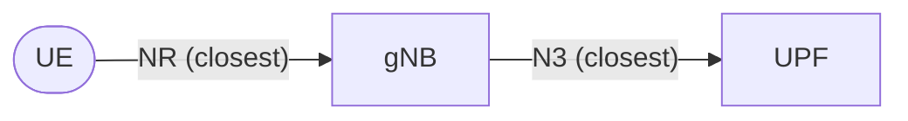
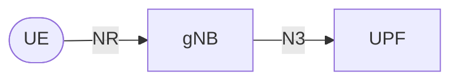

# Agenda

1. How the Simulator Works (In a Nutshell)
2. Available Scenarios
3. Single-Tier Scenario Setup
4. Two-Tier Scenario Setup

---

# 1. How the Simulator Works

The goal is to generate a synthetic but realistic network graph.

**Steps:**

1.  **Load gNBs**: Real data from OpenCellID.
2.  **Load Agents**: Synthetic users based on population density.
3.  **Distribute UPFs**: Optimal placement using K-Means.
4.  **Connect the Dots**: Proximity-based connections.

---

## Step 1: Loading gNBs

*   **Source**: [OpenCellID](https://opencellid.org/) (Public dataset).
*   **Data**: Latitude and Longitude of cell towers.
*   **Goal**: Get ballpark numbers and realistic distribution of Base Stations.

\begin{center}
\includegraphics[width=0.45\textwidth]{docs/simulation-details/in-a-nutshell/images/topology_spain_movistar_gnbs.png}
\end{center}

---

## Step 2: Loading Agents

*   **Agents**: Represent groups of users (e.g., 1 agent = 1000 users).
*   **Distribution**: Proportional to municipality population.
*   **Constraints**: Placed within valid geographic boundaries (polygons) of municipalities.

\begin{center}
\includegraphics[width=0.45\textwidth]{docs/simulation-details/in-a-nutshell/images/topology_spain_movistar_agents.png}
\end{center}

---

## Step 3: Distributing UPFs

*   **Goal**: Place UPFs to minimize squared distance to gNBs.
*   **Method**: K-Means Clustering.
*   **Optimization**: Purely geometric (ignoring orography/roads for simplicity).
*   **Configurable**: The number of UPFs is a parameter (e.g., 52 for Spain - one per province).

---

## Step 4: Connecting the Dots

We build the graph based on **proximity** (minimum Haversine distance).



\begin{center}
\includegraphics[width=0.6\textwidth]{docs/scenarios/single_tier_architecture/images/graph_viz_movistar_spain distributed.png}
\end{center}

---

# 2. Available Scenarios

We have identified three main simulation scenarios:

1.  **Single-Tier Architecture**: Baseline flat topology.
2.  **Two-Tier Architecture**: Hierarchical topology with Edge and Regional UPFs.
3.  **Mobility**: Scenarios involving user movement and handovers.

---

# 3. Single-Tier Scenario Setup

**Topology**:
*   Flat network structure.
*   gNBs connect directly to distributed UPFs.
*   UPFs are **independent** (no interconnection).



---

## Single-Tier Configuration

**Config File (`config.toml`)**:

```toml
[simulation]
scenario_mode = "single_tier"
```

**Scenario Definition**:
*   Define the number of UPFs to spread across the country.
*   Example: `"Spain Edge" = 52` (One UPF per province).

---

# 4. Two-Tier Scenario Setup

**Topology**:
*   Hierarchical structure.
*   **Edge UPFs (UL-CL)**: Close to gNBs, aggregate traffic.
*   **Centralized UPFs (PSA)**: Regional anchors.


---

## Two-Tier Key Differences

**Hierarchical K-Means Clustering**:

1.  **Level 1**: Cluster gNBs to place **Edge UPFs** (e.g., 52 locations).
2.  **Level 2**: Cluster Edge UPF locations to place **Centralized UPFs** (e.g., 5 locations).

**Configuration**:

```toml
[simulation]
scenario_mode = "two_tier"
num_centralized_upfs = 5
```

*   The scenario number (e.g., 52) now refers to the count of **Edge UPFs**.
